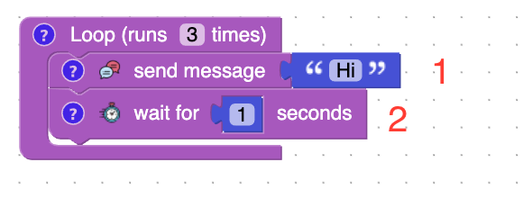

# Blink

## Objective

How to write and basic program to control leds and how to uplaod that code to the Arduino.

## Kit

## Bill of Materials

- 1 x Arduino with cable
- 1 x Breadboard
- 2 x leds
- 2 x resistors (100 - 200 ohms)
- 2 x led wires

## Project

<video controls>
  <source src="https://storage.googleapis.com/electroblocks-lessons/blink/blink-project.mp4" type="video/mp4">
</video>

## Components

### Led

The led stands for light emitting diode. The important thing to note are the wires connected to it. The long wire is positive and the short wire is negative. When you pass electricity through it, it will emit light.

### Resistor

The resistor is used to decrease the amount of electrons flowing through the wire. The strength of the resistor is marked by the colored bands. You can use the [calculator](https://www.allaboutcircuits.com/tools/resistor-color-code-calculator/) to learn more.

### Breadboard

The breadboard is used to create / prototype electronic projects without gluing the wires together with metal. It does this by allowing wires to share electricity that are plugged into it. See the picture below. The green lines represent how which pins share electricity. In the middle of the board pins connectted up and down share electricity. On the side of the board pins are connected side to side.

<video controls>
  <source src="https://storage.googleapis.com/electroblocks-lessons/blink/breadboard-electroblocks.mp4" type="video/mp4">
</video>

## Code

There are two main blocks of code you need to know about when programming the Arduino. The setup block and the loop block. The loop block will run over and over again. The setup block will only run once. The way it works the blocks at the top of the loop or setup block will execute first.

The example above the send message block would run first then the wait block.

### Loop Block

Notice the loop block has (runs x times) in it. That is how many times it will run on the virtual circuit. In the actual Arduino it runs forever.

## Steps

### Wiring the first led

1\. Insert the led positive (long) end of the led into (27, E) and the short (-) end into (25, E).

2\. Connect a resistor from (27, D) to (27, B).

3\. Connect a wire from - of the breadboard to (25, A).

4\. Connect a wire from (27, A) to pin 7 on the Arduino.

5\. Connect a wire from - of the breadboard to GND of the Arduino.

### Uploading Test Code

It takes about 10 seconds to upload code on the real Arduino. I editted it out of the videos.

Go to [electroblocks.org](https://electroblocks.org)

<video controls>
  <source src="https://storage.googleapis.com/electroblocks-lessons/blink/upload-test-code.mp4" type="video/mp4">
</video>

### Coding Blink

<video controls>
  <source src="https://storage.googleapis.com/electroblocks-lessons/blink/coding-blink.mp4" type="video/mp4">
</video>

### Wiring the second led

1\. Connect the long end of the led into hole (37, E) and the short into (36, E).

2\. Connect a wire from (36, A) to the ground - line of the breadboard.

3\. Connect a resistor from (37, D) to (37, B).

4\. Connect a wire from (37, A) to pin 5 on the Arduino.

## Challenge make both leds blink at the same time.

<video controls>
  <source src="https://storage.googleapis.com/electroblocks-lessons/blink/double-blink.mp4" type="video/mp4">
</video>

## Challenge make leds in an alternate pattern

<video controls>
  <source src="https://storage.googleapis.com/electroblocks-lessons/blink/alt-blink.mp4" type="video/mp4">
</video>

## Review

- What is an led?
- What is the first block that gets executed in the loop block?
- What does the delay block do?
- What is a breadboard?
