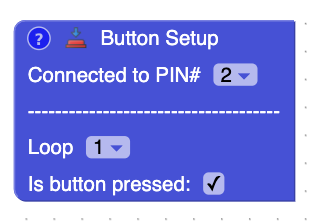
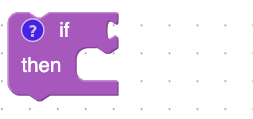
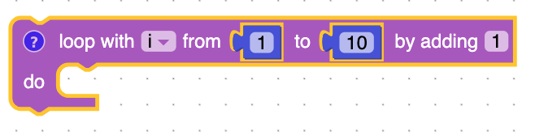
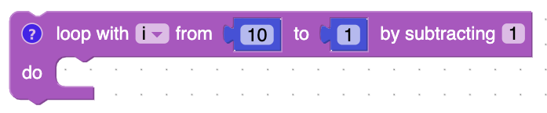
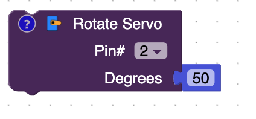

# Blocks

## Button Setup

This block will tells the Arduino which pin to connect the button to.  The stuff under the ----------- is for the virtual circuit.  It's used to tell the virtual circuit whether the button is pressed or not in the loop that the circuit is running.

## Get Variable 

A variable is one way you can tell the computer to store something.  The get variable block will get the value that is being stored inside the variable.  

## If 

The block is used to make decisions.  If what is connectted to the if block is true then what is inside the do block will be ran.

## Is Button Pressed

This block will return if the button is pressed.

## Loop

Blocks inside the block will run forever on the actual Arduino.  It will be from top to bottom, and once it reaches the bottom block, it will go back to the top block.  The simulator on the right of the screen will run three times. 

## Loop With

This block is used to repeat something over and over again.  It creates a variable often called "i".  It will start i at the from number and will add or subtract the value stored in i until it gets to the to number.  The best way to understand loops in Electroblocks is to play around with them.

## Led

The LED block controls whether an led is on or off.  The first drop-down decides which [Arduino Pin](/lessons/what-is-an-arduino.html#what-are-pins) the led is connected to.  The second dropdown turns the LED on or off.

## Servo

The servo controls the data pin that the servo is connectted to and number of degress that you want to rotate the servo.  The higher the number the more the servo will rotate.

## Wait

The wait block will pause the Arduino.

