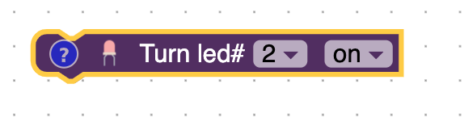

# Blocks

## Loop

Blocks inside the block will run forever on the actual Arduino.  The will be from the top to the bottom and once it reaches the bottom block it will go back to the top block.  In the simulator on the right of the screen it will run for 3 times or whatever you set it to.

## Led

The LED block controls whether an led is on or off.  The first drop down decides which [Arduino Pin](/lessons/what-is-an-arduino.html#what-are-pins) the led is connected to.  The second dropdown turns the LED on or off.

## Wait

The wait block will pause the Arduino for a number of seconds.

