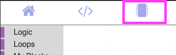
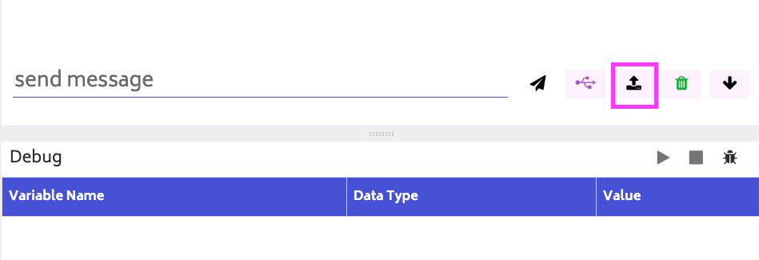
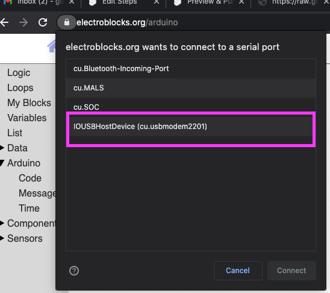
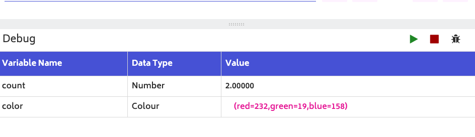

# How to debug code on the Arduino in Electroblocks?

<iframe width="535" height="450" src="https://www.youtube.com/embed/46Ts7JPfZG0?rel=0"  frameborder="0" allow="accelerometer; autoplay; clipboard-write; encrypted-media; gyroscope; picture-in-picture" allowfullscreen></iframe>

## Steps

1\. Download the [project](https://electroblocks.org/projects/debug_code.xml) and open it in [ElectroBlock](https://electroblocks.org).

2\. Click on the microchip menu option.

3\. Click the upload button.

It will be on the bottom right of your screen.

4\. Choose the Arduino USB Option

It usually the one that has the word USB in it.

5\. After the code is uploaded click the connect button.

It will be on the bottom right of your screen.

6\. Watch the debug menu

The green button is used to unpause the Arduino. The red stop button will stop debugging all together. Click the green button and see the values update on your arduino.
