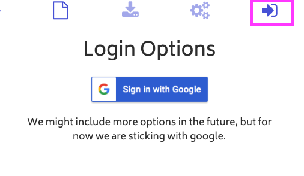
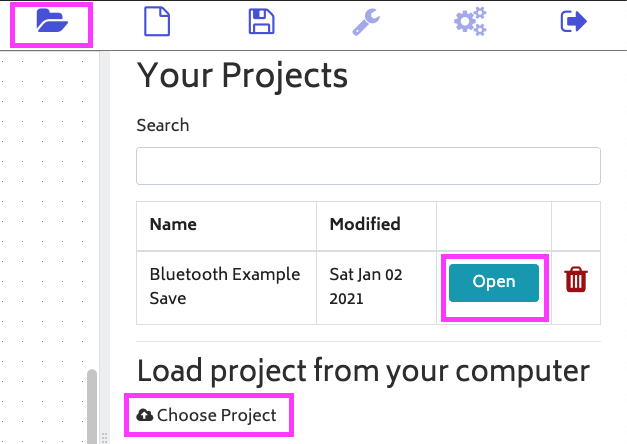

# How to open a project in ElectroBlocks.

## Steps

1\. Login to ElectroBlocks.

Click on the login icon highlighted then click on the sign in with the Google button. The icon will be on the top right of your screen.

2\. Click on the folder in the midde of your screen. Then click on open button of the project you want to open.

You can also open an ElectroBlock project file by clicking the choose project text.
