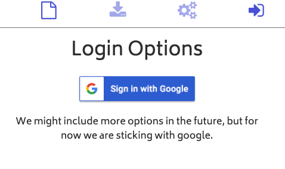
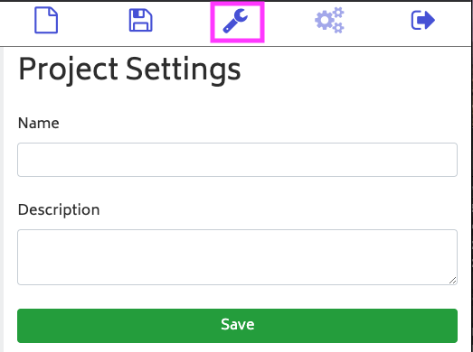

# How to save a project in ElectroBlocks

## Steps

1\. Click the login button.

You must have a Gmail account to log in. The login button is on the top right side of the screen.

2\. Click the sign in with Google button.

This will take you through the signing in.

3\. Click on the wrench icon.

Fill out the form and click save to save the project.
