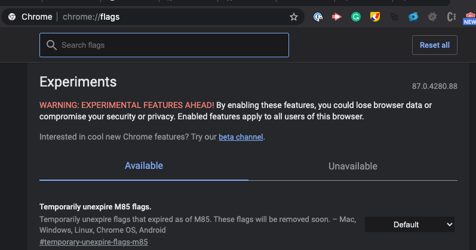
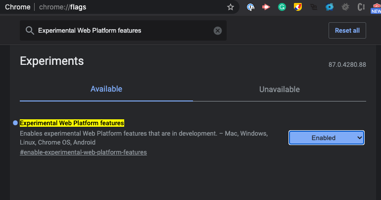
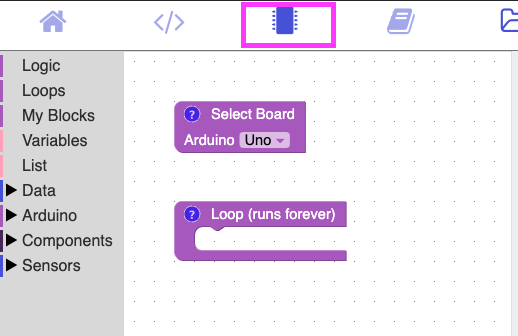
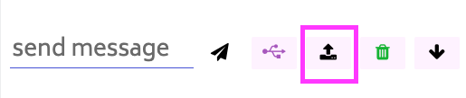
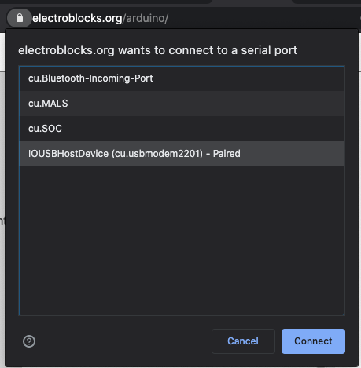

# Uploading Coding

<iframe width="535" height="450" src="https://www.youtube.com/embed/IkeoqS-d7AE?rel=0"  frameborder="0" allow="accelerometer; autoplay; clipboard-write; encrypted-media; gyroscope; picture-in-picture" allowfullscreen></iframe>

## Warning

To upload code you need enable a flag in google chrome. This will only work with the google chrome browser. You do this at your own risk.

## Steps

1\. In a separate tab type in chrome://flags

2\. Search for Experimental Web Platform features & enable it.

This will require you to relaunch your web browser. Click the relaunch button at the bottom of your screen.

3\. Click on the MicroChip Menu Option

4\. Click on the upload button

This will be on the bottom right of your screen.

5\. Select the Arduino Option

It's usually the one that says USB. Once you click connect, it usually takes 5 to 15 seconds.
