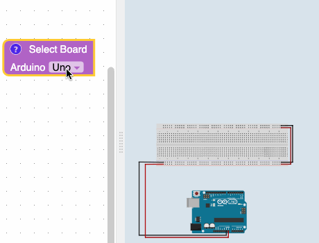
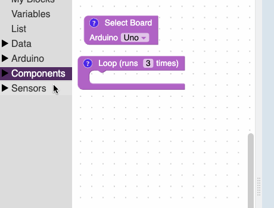

# Getting Started

<iframe width="90%" height="700" src="https://www.youtube.com/embed/Ur8dYcJAE6A?rel=0"  frameborder="0" allow="accelerometer; autoplay; clipboard-write; encrypted-media; gyroscope; picture-in-picture" allowfullscreen></iframe>

## Board Selector Block

This block is used to decide which kind of microcontroller / Arduino you want to use.

## How to add blocks

As you drag blocks into the loop you create the circuit.

## Blocks outside the loop are disabled

There are few exceptions to this, like setup blocks. We'll go over them in a later tutorial. :)

## Building a circuit

I used command or control key + c to copy and command or control key + v to paste.

## Playing Circuit

Use the play button to see the circuit in action.

## How to see the code

