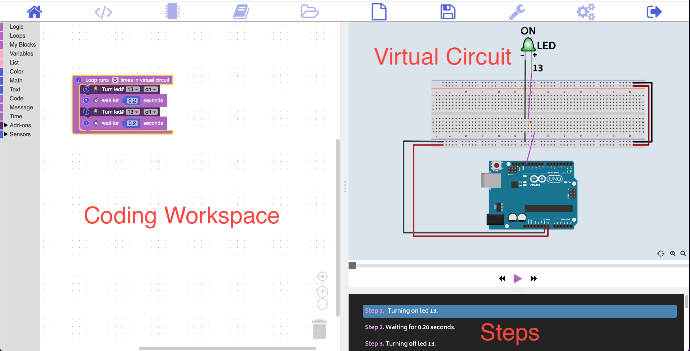
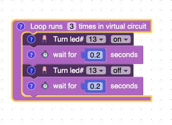
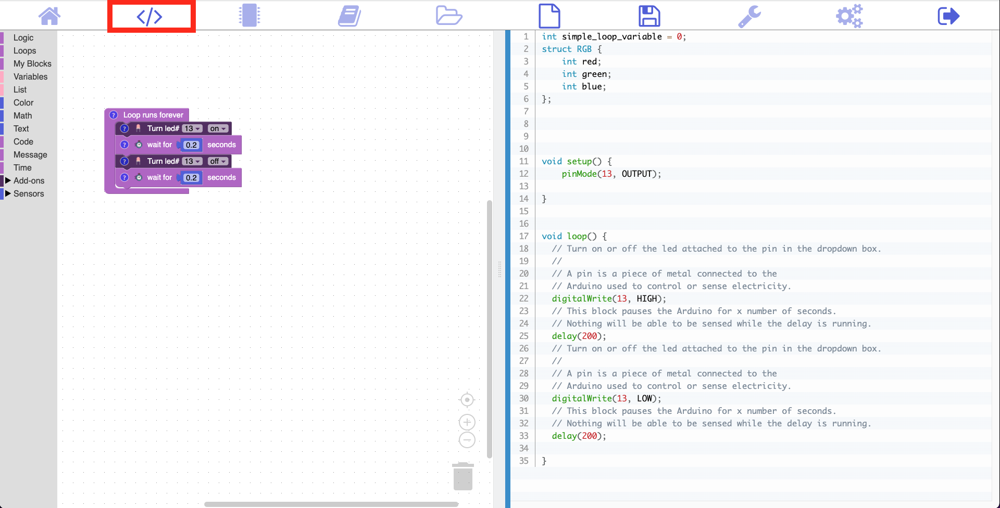
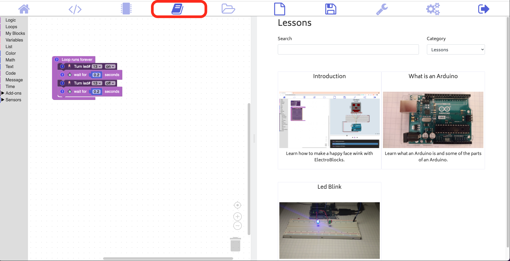

# Getting Started

<iframe width="560" height="315" src="https://www.youtube.com/embed/t086a8xrfqk" title="YouTube video player" frameborder="0" allow="accelerometer; autoplay; clipboard-write; encrypted-media; gyroscope; picture-in-picture" allowfullscreen></iframe>

## Home Page

### Coding workspace

Coding workspace is on the left of the screen and it's where you will drag and drop blocks into.

### Virtual Circuit

The virtual circuit gives you a live preview of what your code will do.

### Steps

Steps are the step by step instructions for what your code will do in the circuit.  Each step corresponds with a block.

## Loop Block

This block will run forever on a real Arduino but only three times through the virtual circuit. What this means is that all the blocks inside the loop block will run three times. You can change this number to whatever positive number you want.

## Question about a block?

If you have a question about a block click on the question mark.

## Code Page

This shows you the text base code that you are writing.  

## Arduino Page

With the Arduino page, you can upload code, send and receive messages and live debugging.

## Lesson Page

This page displays all the lessons currently avialable.
