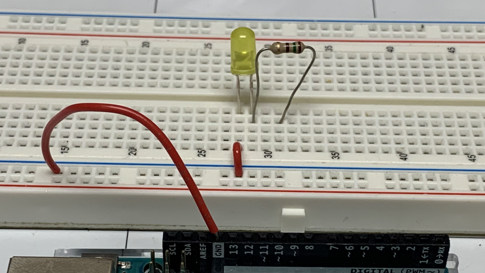
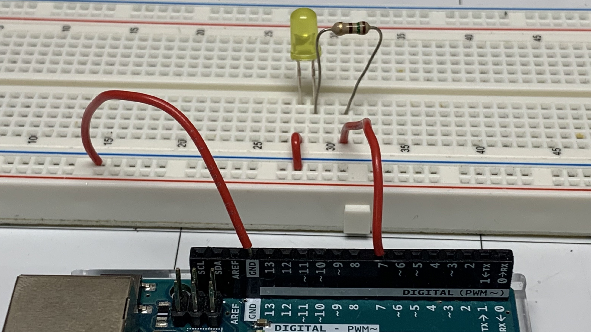

# Blink

<iframe width="535" height="450" src="https://www.youtube.com/embed/ql9KSAkS9kc?rel=0"  frameborder="0" allow="accelerometer; autoplay; clipboard-write; encrypted-media; gyroscope; picture-in-picture" allowfullscreen></iframe>

## What you will learn

How to write and basic program to control leds and how to uplaod that code to the Arduino.

## Bill of Materials

- 1 x [Arduino with cable](lessons/what-is-an-arduino/)
- 1 x [Breadboard](/addons#breadboard)
- 2 x [Leds](/addons#led)
- 2 x [Resistors](/addons#resistor) (100 - 400 ohms)
- 5 x wires

## Blocks

- [Loop](/blocks#loop)
- [Led](/blocks#led)
- [Wait](/blocks#wait)

## Wiring Diagram

## Steps First LED

1\. Have the front of the Arduino face towards 1 of the breadboard.

2\. Connect a wire from - of the breadboard to a GND pin on the Arduino.

3\. Connect a wire from (28, A) to the - of the breadboard.

4\. Insert the led's short (-) wire into (28, E) and the led's long (+) wire into (29,E).

5\. Connect a resistor from (29, D) to (31, D).

6\. Connect a wire from (31, A) to pin 7 on the Arduino.

7\. Connect the Arduino into the computer.

## Steps Second LED

1\. Connect a wire from (40, A) to the - of the breadboard.

2\. Insert the led's short (-) wire into (40, E) and the led's long (+) wire into (41,E).

3\. Connect a resistor from wiring (41, D) to (43, D).

4\. Connect a wire from (43, A) to pin 4 on the Arduino.

## Review

- What is an led?
- What is the first block that gets executed in the loop block?
- What does the delay block do?
- What is a breadboard?
