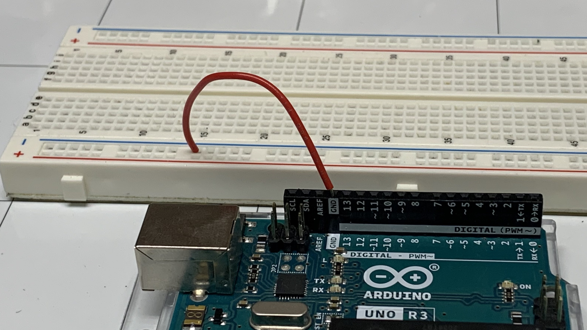
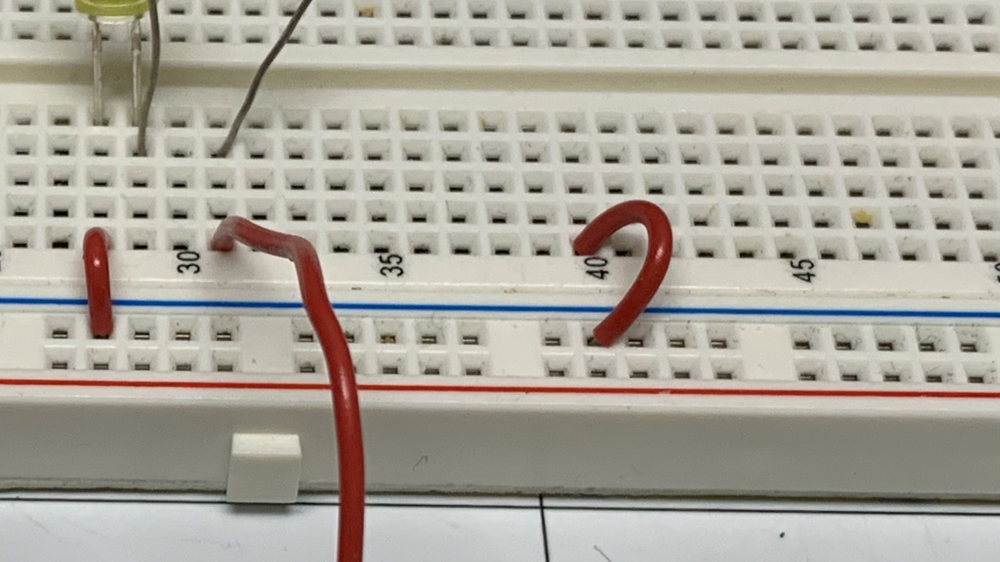

# Blink

## Objective

How to write and basic program to control leds and how to uplaod that code to the Arduino.

## Kit

## Bill of Materials

- 1 x Arduino with cable
- 1 x Breadboard
- 2 x leds
- 2 x resistors (100 - 400 ohms)
- 5 x led wires

## Project

<iframe width="535" height="450" src="https://www.youtube.com/embed/MvAc5SSh3qY?rel=0"  frameborder="0" allow="accelerometer; autoplay; clipboard-write; encrypted-media; gyroscope; picture-in-picture" allowfullscreen></iframe>

## Video

<iframe width="535" height="450" src="https://www.youtube.com/embed/BoCXdEJlM2E?rel=0"  frameborder="0" allow="accelerometer; autoplay; clipboard-write; encrypted-media; gyroscope; picture-in-picture" allowfullscreen></iframe>

## Components

### Led

Led stands for light-emitting diode. A diode is an electronic component that allows electricity to flow one way.

The important thing to note is the wires connected to it. The long wire is positive, and the short wire is negative. When you pass electricity through it, it will emit light.

### Resistor

Resistors are used to decrease the number of electrons flowing through the wire. The colored bands mark the strength of the resistor. You can use the [calculator](https://www.allaboutcircuits.com/tools/resistor-color-code-calculator/) to learn more.

### Breadboard

The breadboard is used to prototype electronic projects without gluing the wires together with metal. It does this by allowing wires to share electricity that is plugged into it.

The green lines represent how which pins share electricity. In the middle of the board, pins connected up and down share electricity. On the side of the board, pins are connected side to side.

<iframe width="535" height="450" src="https://www.youtube.com/embed/kkb8RzGg_Ag?rel=0" frameborder="0" allow="accelerometer; autoplay; clipboard-write; encrypted-media; gyroscope; picture-in-picture" allowfullscreen></iframe>

## Code

In a real Arduino, the blocks inside the loop block will run on repeatedly until the Arduino loses power. The first blocks to run will be the ones on top.

Notice the loop block has (runs x times) in it. That is how many times it will run on the virtual circuit.

## Steps

### Wiring the first led

1\. Insert the led positive (long) end of the led into (27, E) and the short (-) end into (25, E).

2\. Connect a resistor from (27, D) to (27, B).

3\. Connect a wire from - of the breadboard to (25, A).

4\. Connect a wire from (27, A) to pin 7 on the Arduino.

5\. Connect a wire from - of the breadboard to GND of the Arduino.

### Uploading Test Code

It takes about 10 seconds to upload code on the real Arduino. I editted it out of the videos.

Go to [electroblocks.org](https://electroblocks.org)

<iframe width="535" height="450" src="https://www.youtube.com/embed/zQi7C1hIvqw?rel=0" frameborder="0" allow="accelerometer; autoplay; clipboard-write; encrypted-media; gyroscope; picture-in-picture" allowfullscreen></iframe>

### Coding Blink

<iframe width="535" height="450" src="https://www.youtube.com/embed/V3Xd82vxuoc?rel=0" frameborder="0" allow="accelerometer; autoplay; clipboard-write; encrypted-media; gyroscope; picture-in-picture" allowfullscreen></iframe>

### Wiring the second led

1\. Connect the long end of the led into hole (37, E) and the short into (36, E).

2\. Connect a wire from (36, A) to the ground - line of the breadboard.

3\. Connect a resistor from (37, D) to (37, B).

4\. Connect a wire from (37, A) to pin 5 on the Arduino.

## Challenge make both leds blink at the same time.

<iframe width="535" height="450" src="https://www.youtube.com/embed/joqkdb_NEbw?rel=0" frameborder="0" allow="accelerometer; autoplay; clipboard-write; encrypted-media; gyroscope; picture-in-picture" allowfullscreen></iframe>

## Challenge make the led alternate on and off

<iframe width="535" height="450" src="https://www.youtube.com/embed/7byRlOOwZ1Y?rel=0" frameborder="0" allow="accelerometer; autoplay; clipboard-write; encrypted-media; gyroscope; picture-in-picture" allowfullscreen></iframe>

## Review

- What is an led?
- What is the first block that gets executed in the loop block?
- What does the delay block do?
- What is a breadboard?
