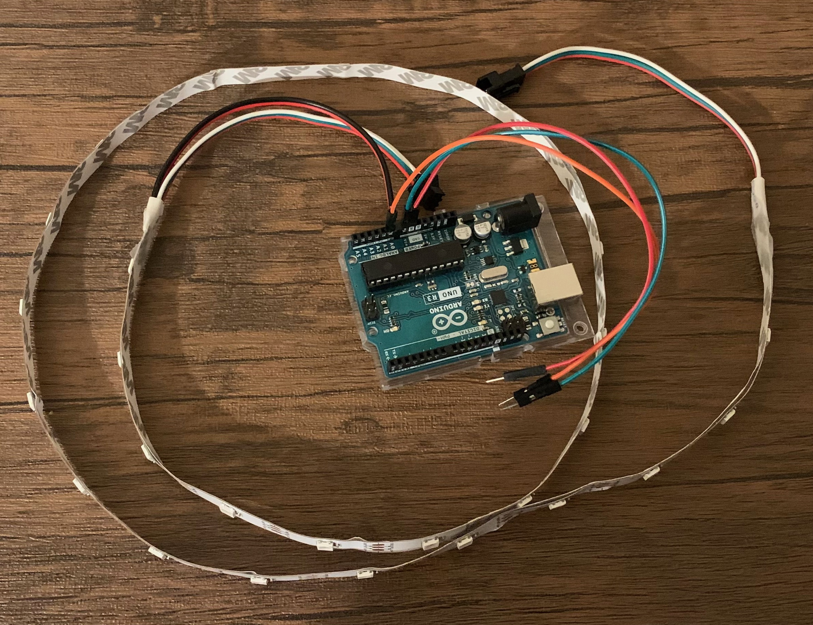
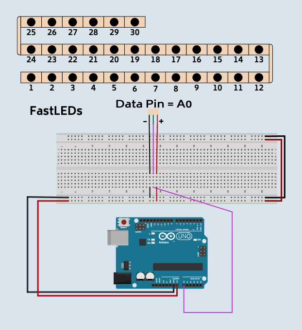
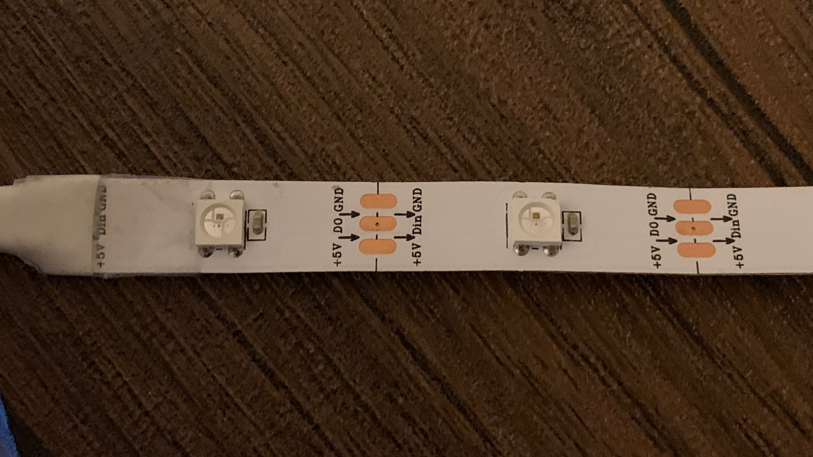
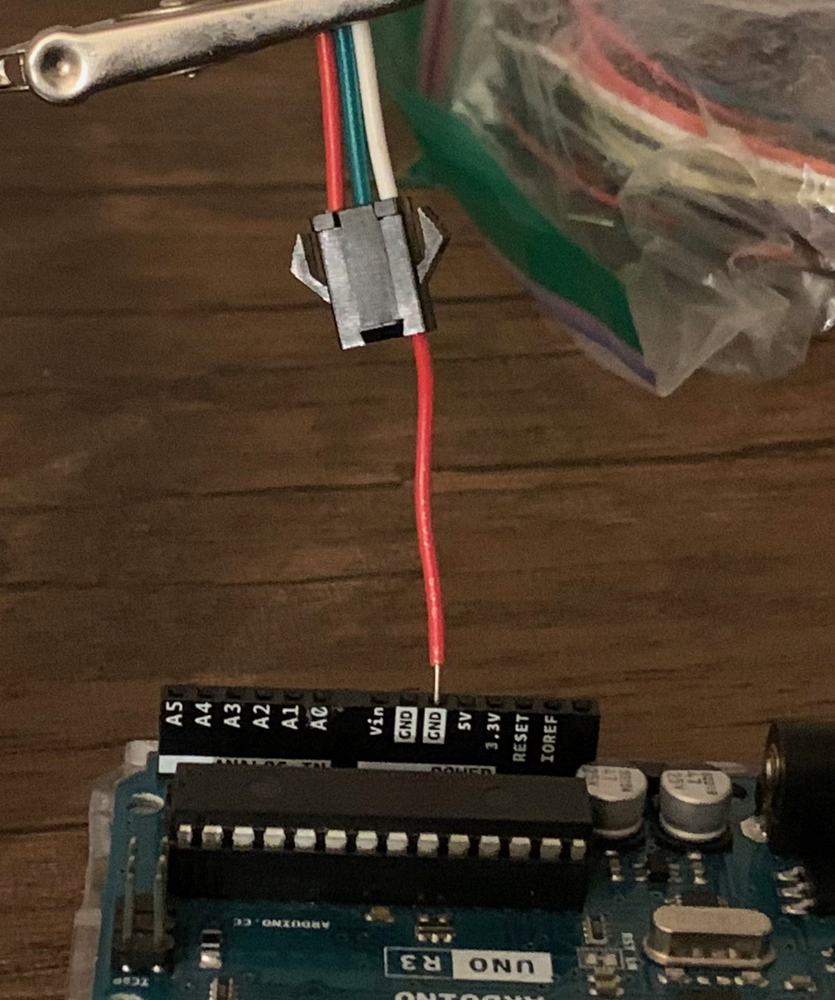
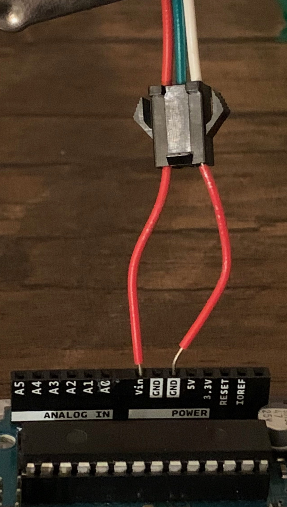
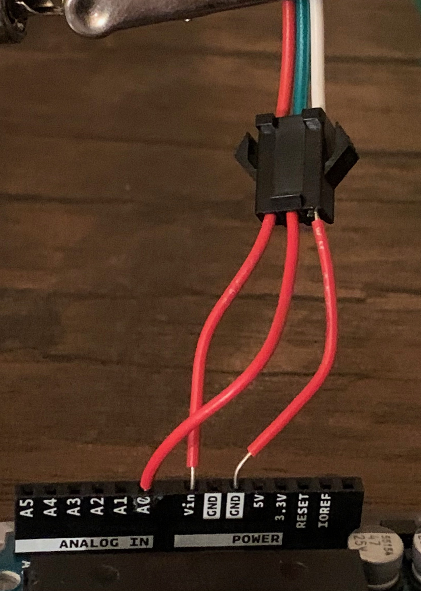

# Fast LEDs

This lesson page will serve for as the reference for all lessons related the FAST Leds.  It contains how to wire them and what to do.

## What you will learn

- How to do cool led light patterns
- Advanced loops
- How to create random colors
- How to wire up and rgb led light strip

## Bill of Materials

- 1 x [Arduino with cable](../what-is-an-arduino/)
- 1 x [RGB LED Light Strip](../../addons#rgb-light-strip)
- 3 x wires

## Blocks

- [FastLED Setup](../../blocks#fastled-setup)
- [FastLED Change Color](../../blocks#fastled-set-color)
- [Loop with](../../blocks/#loop-with)
- [Get Variable](../../blocks/#get-variable)
- [Wait](../../blocks#wait)
- [Color Picker](../../blocks#color-picker)

## Wiring Diagram

## Coding Videos

<!-- <video controls >
<source src="https://firebasestorage.googleapis.com/v0/b/inapp-tutorial.appspot.com/o/electroblocks-org%2FGcym9zmref566fEFWgYy%2Fstep_Vs5B6xqmI07XAXGNCs4n.mp4?alt=media&token=91ccea63-4d80-4b5d-a243-597eaf92ecea">
</video> -->

## Steps

1\. Look at RGB LED light strip.  Notice the arrows.  The direction that the arrows point is how the LEDS are numbered. 

This is how it looks like if each LED were a number:

1 -> 2 -> 3 -> 4

Also notice the labels Din, GND, 5v+.

- Din -> Mean data in.  This wire controls the data in the rgb led. It will go to an analog pin.
- GND -> Ground
- 5v+ -> 5 volts

2\. Connect a wire from GND of the LED Light Strip to GND of the Arduino.  Consult you LED Light Strip for GND.

3\. Connect a wire from 5v+ of the LED Light Strip to Vin of the Arduino.  Consult you LED Light Strip for 5v+.  Vin will supply the max power and will give better performance from my experience.

4\. Connect a wire from Din of the LED Light Strip to A0 of the Arduino.

