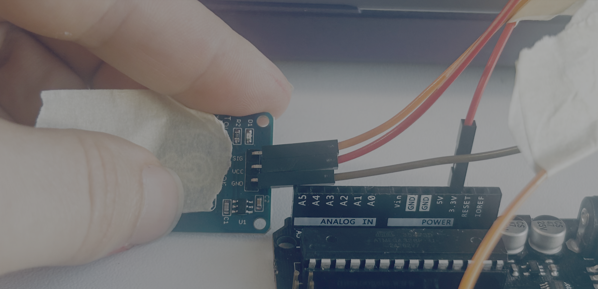
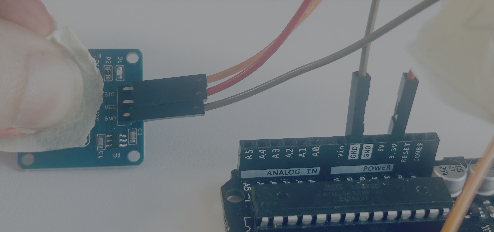

# Flappy Bird

In this lesson you will build a flappy bird game controller with a Arduino and a touch sensor.

<video controls >
<source src="https://storage.googleapis.com/noah-education-videos/electroblocks/flappybird/FlappyBird.MOV">
</video>


## What you will learn

- How to use a touch sensor
- How to send message to a computer from the Arduino
- How to use an if block

## Bill of Materials


- 1 x [Arduino with cable](../what-is-an-arduino/)
- 1 x [Touch Sensor](../../addons#Touch-Sensor)
- 3 x wires

## [Slides](https://docs.google.com/presentation/d/1NajQaFKaowK2HvOcsfEApE3_9FElnhDUdM8chXerAbw/edit?usp=sharing)

## Build Steps

1\. Connect a jumper wire from the SIG pin of the touch sensor to pin 7 of the Arduno.


2\. Connect a jumper wire from vcc of the touch sensor to the 3.3v pin of the Arduino




3\. Connect a jumper wire from gnd of the touch sensor to a gnd pin on the Arduino



## Coding Demo

Flow the video to code and to upload the code.

<video controls >
<source src="https://storage.googleapis.com/noah-education-videos/electroblocks/flappybird/demo_code.mov">
</video>


## Flappy Bird Game Connection Demo

<video controls >
<source src="https://storage.googleapis.com/noah-education-videos/electroblocks/flappybird/demo_game.mov">
</video>


[Game](https://codepen.io/noah-glaser/pen/xbwMObP)


## Challenge (Make the game playable)

Find this section of the code and play with the variables.

```js
    const G = 0.45;          // gravity
    const JUMP_V = -3.8;     // jump velocity
    const PIPE_GAP = 150;    // vertical gap size
    const PIPE_W = 60;       // pipe width
    const PIPE_SPACING = 220;// distance between pipes
    const SCROLL = 2.4;      // world scroll speed
```