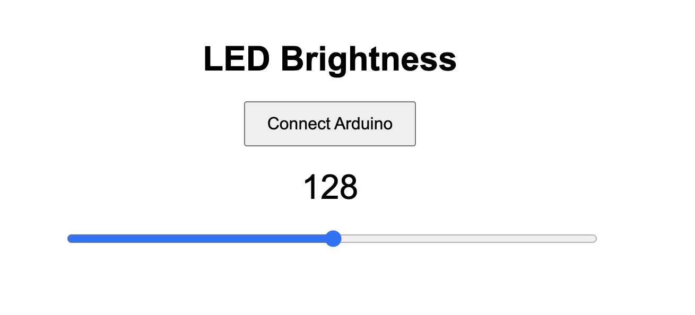
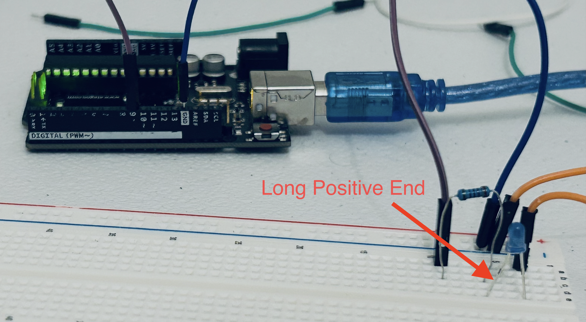
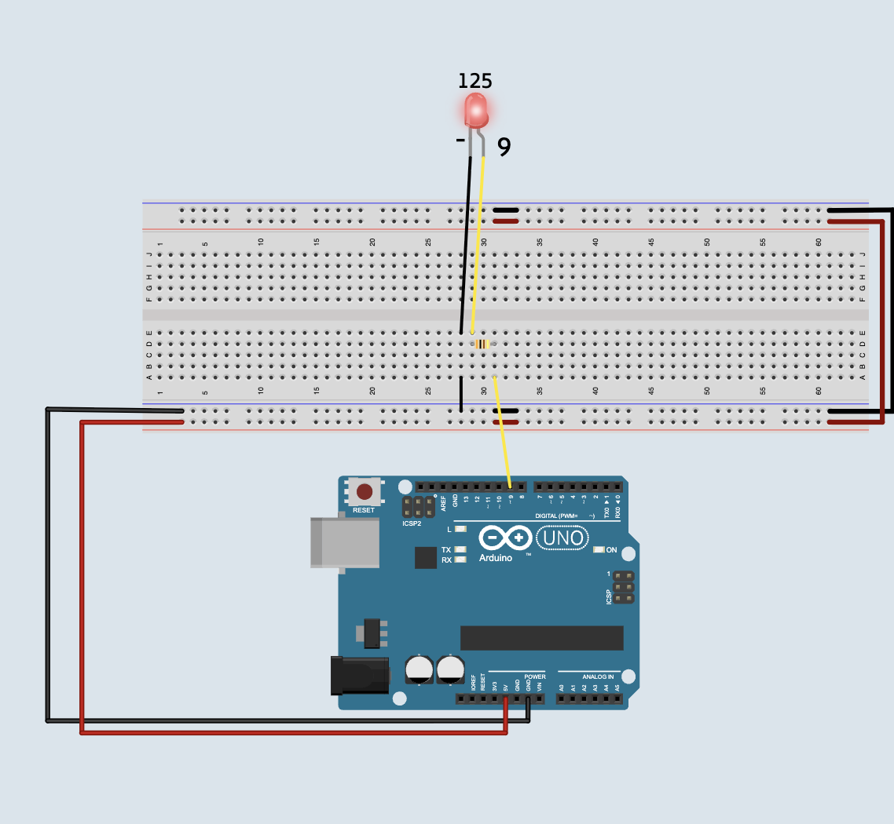
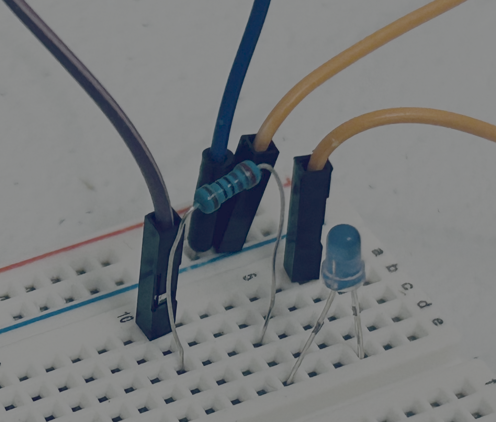

# Build a Remote-Controlled Flashlight 🔦

In this lesson you'll build an LED flashlight and control its brightness from a webpage.

<video controls >
<source src="https://storage.googleapis.com/electroblocks/lessons/flashlight/live_demo.mp4">
</video>

## What You'll Need

- Arduino
- Breadboard
- LED
- Resistor
- Jumper wires

## LED Tip

LEDs only work in one direction.

Long leg  = Positive (+)
Short leg = Negative (-)

## Breadboard Tip

A breadboard lets us connect parts without gluing them together.

## Step 1: Build It

## Test Code

<video controls >
<source src="https://storage.googleapis.com/electroblocks/lessons/flashlight/flashlight_works.mp4">
</video>

Upload this first to make sure your LED is wired correctly. If the LED turns on, your wiring works!

## Coding 

<video controls >
<source src="https://storage.googleapis.com/electroblocks/lessons/flashlight/flightlight_complete.mp4">
</video>

## Using the site

<video controls >
<source src="https://storage.googleapis.com/electroblocks/lessons/flashlight/using_webpage.mp4">
</video>

1\.   Only one website can connect to the Arduino at a time. Close ElectroBlocks before opening the flashlight website.

2\. Go here [FlashLight Website](https://phptuts.github.io/CHM/ElectroBlocks/Flashlight/index.html) and click the connect button.  

3\. Move the slider. Low numbers make the LED dim. High numbers make the LED bright.

## Challenge ⭐

- Can you add a second LED?
- Can you write code to make a blinking light if you type the word "blink"
- Can you make your own light patterns.