# Blink

## What you will learn

- How to build a highfive machine
- How to make an Arduino respond when something happens
- If Blocks
- Electrical components like servos and push buttons

## Bill of Materials

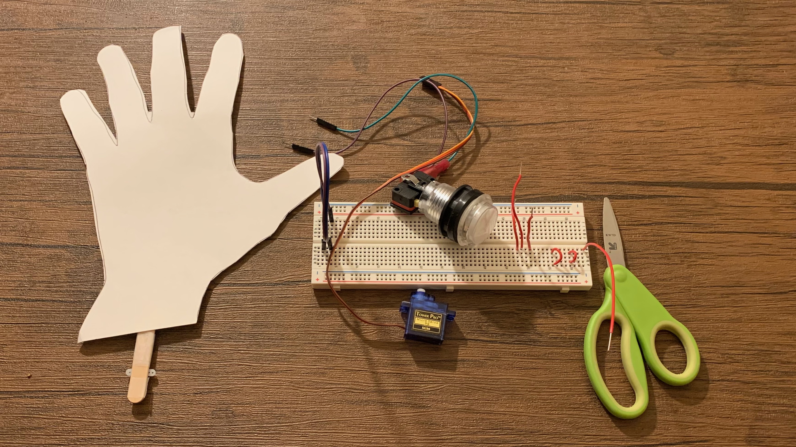

- 1 x [Arduino with cable](../what-is-an-arduino/)
- 1 x [Breadboard](../../addons#breadboard)
- 1 x [Push Button](../../addons/#push-buttons)
- 1 x [Servo](../../addons/#servos)
- 1 x posterboard
- 1 x scissor
- 7 x wires

## Blocks

- [Servo](../../blocks#servo)
- [Wait](../../blocks#wait)
- [If](../../blocks#if)
- [Button Setup](../../blocks#button-setup)
- [Is Button Pressed](../../blocks#is-button-pressed)

## Wiring Diagram

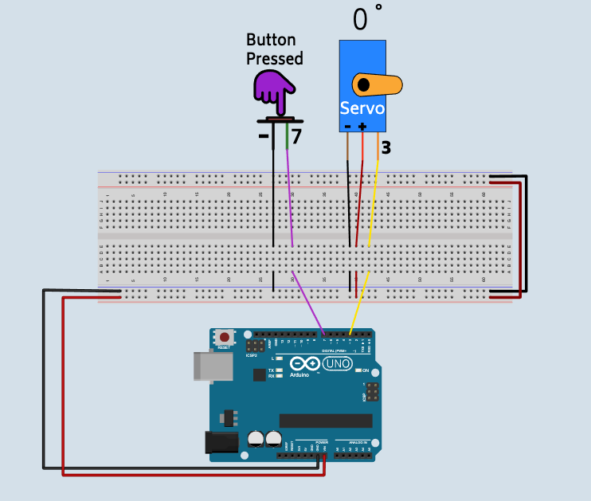

## Coding Video

<video controls >
<source src="https://firebasestorage.googleapis.com/v0/b/inapp-tutorial.appspot.com/o/electroblocks-org%2FGcym9zmref566fEFWgYy%2Fstep_Vs5B6xqmI07XAXGNCs4n.mp4?alt=media&token=91ccea63-4d80-4b5d-a243-597eaf92ecea">
</video>

## Building Highfive Machine

1\. Have the front of the Arduino face towards 1 of the breadboard.

2\. Connect a wire from (27, A) to the - of the breadboard.

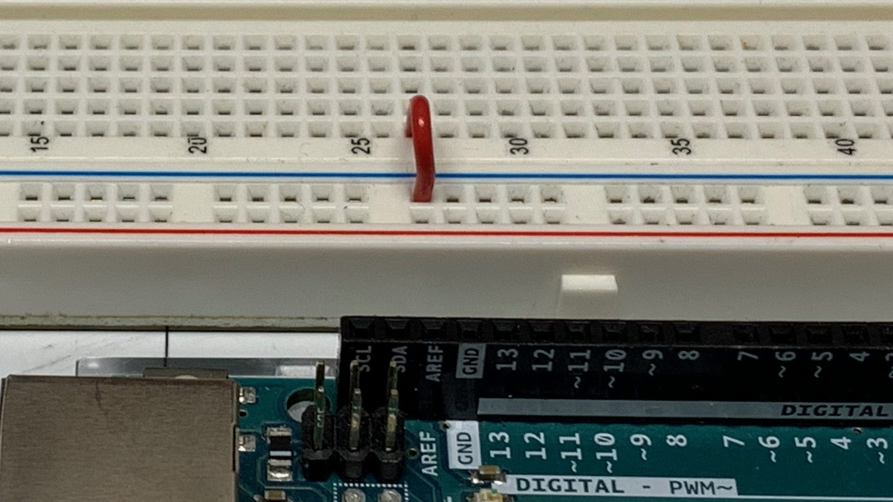

3\. Connect one of the buttons to hole  (27, E) and the other wire to (30, E).

4\. Connect a wire from (30, A) to pin 7 on the Arduino.

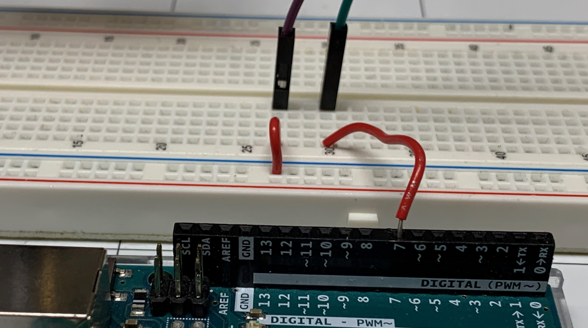

5\. Connect a wire from (39, E) to the ground wire on the servo.  On these servos, the ground wire is brown.

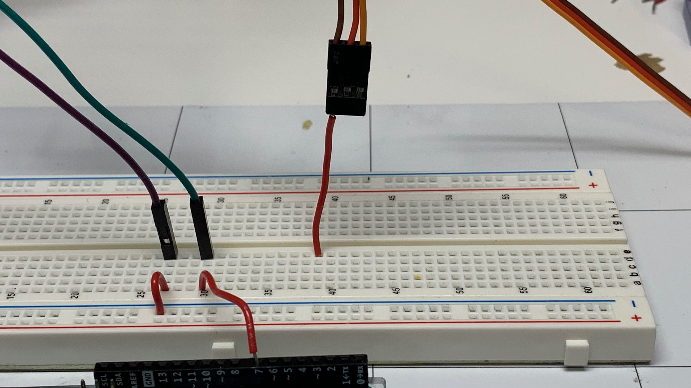

6\. Connect a wire from (40, E) to the power wire on the servo.  On these servos, the power wire is red.

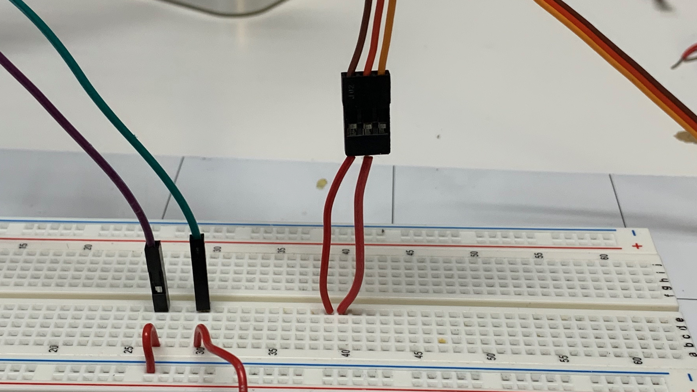

7\. Connect a wire from (42, E) to the data on the servo.  On these servos, the data wire is orange.

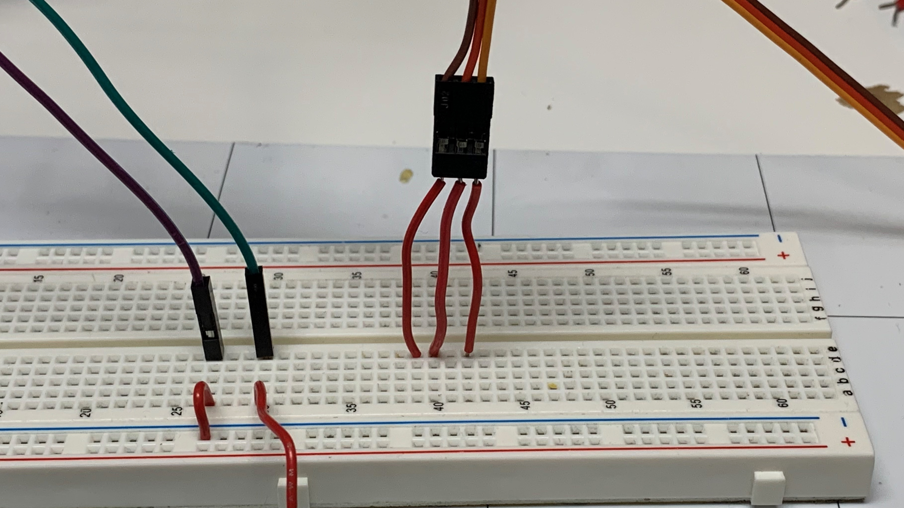

8\. Connect a wire from (39, A) to the - of the breadboard.

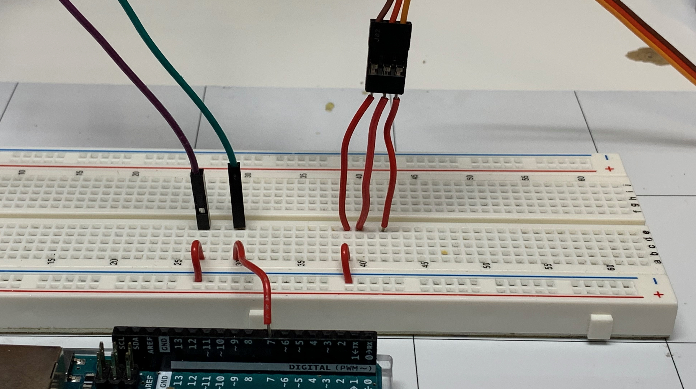

9\. Connect a wire from (40, A) to the + of the breadboard.

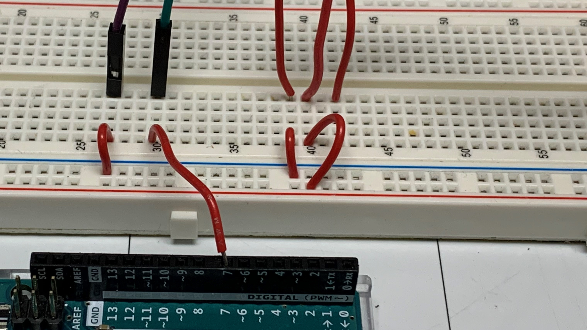

10\. Connect a wire from (42, A) to pin 3 on the Arduino.

11\. Connect a wire from - of the breadboard to a GND pin on the Arduino.

12\. Connect a wire from + of the breadboard to a 5v pin on the Arduino.

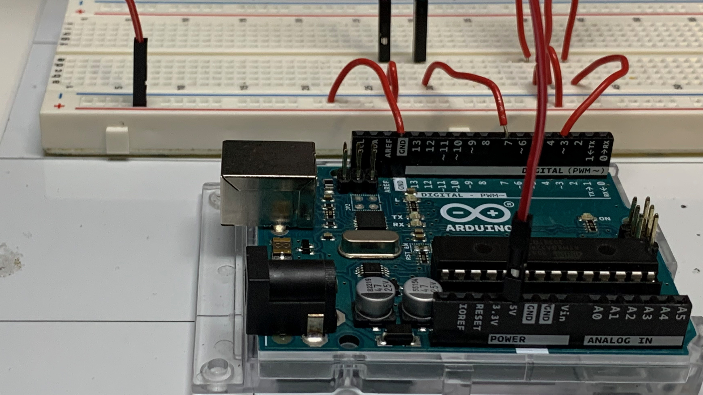

13\. Trace and cut out your hand from a piece of posterboard.

14\. Tape a popsicle stick the back of your posterboard hand.

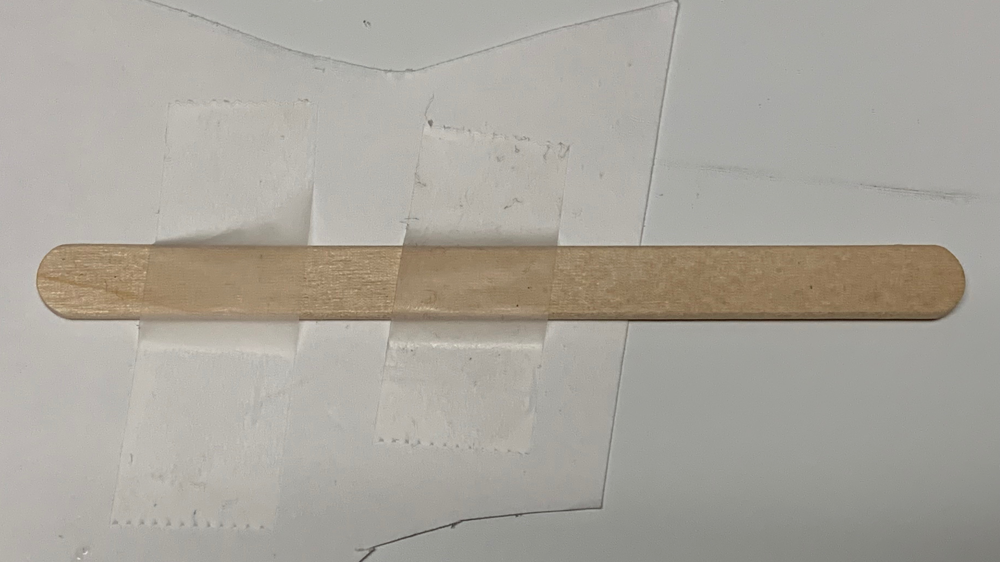

15\. Tape the plastic wing to the popsicle stick.

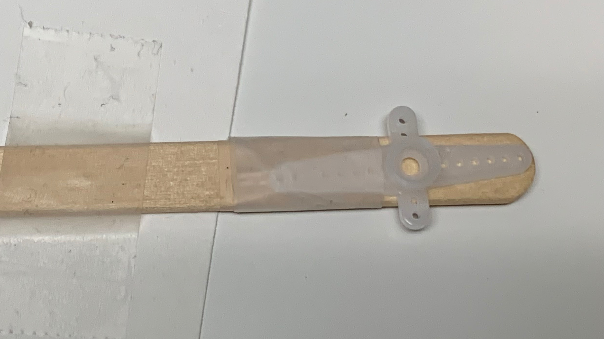

16\. Tape the servo to the table.

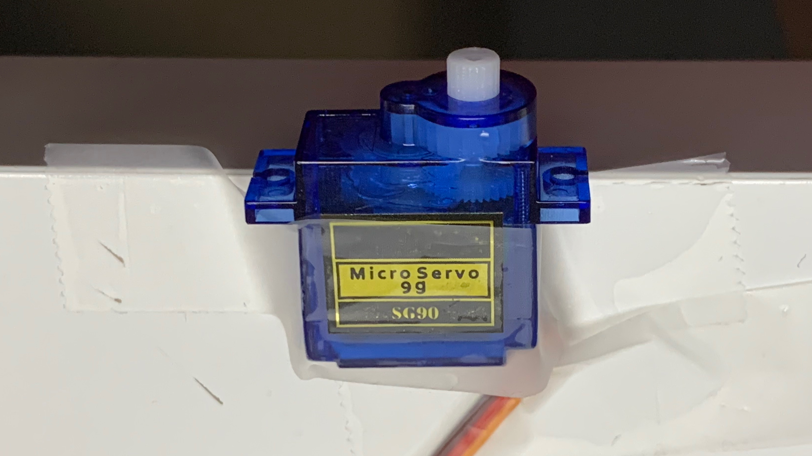

17\. Connect the servos wings to the servo.

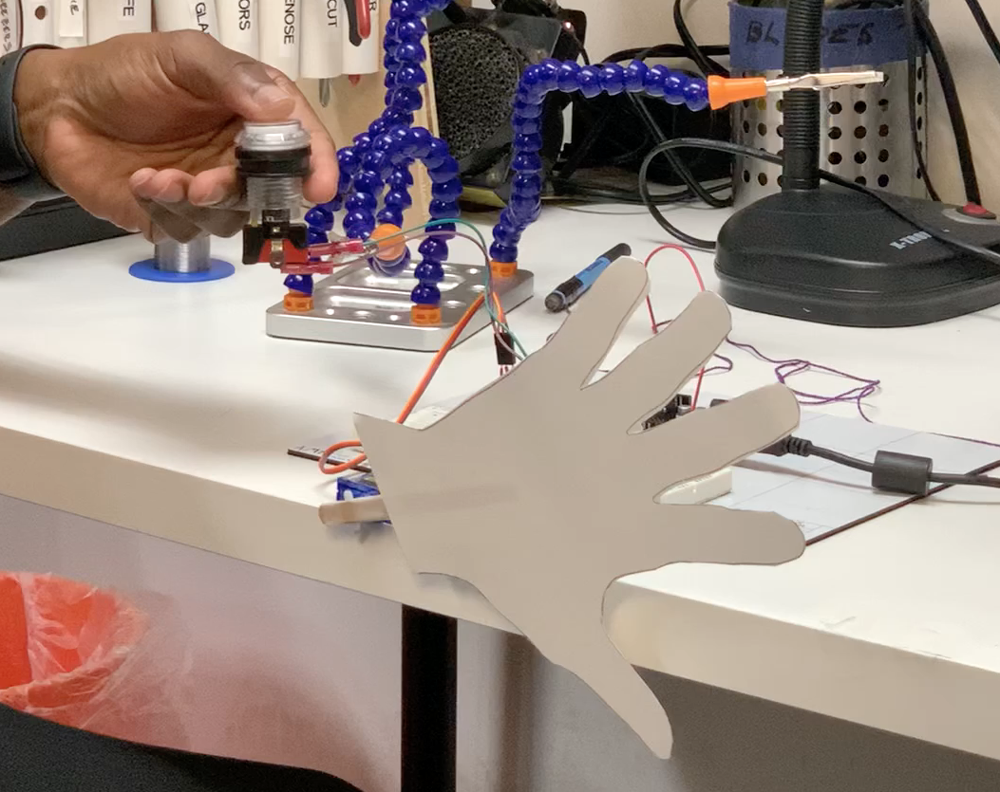

## Review

- What is an led?
- What is the first block that gets executed in the loop block?
- What does the delay block do?
- What is a breadboard?
