# HighFive

## Objective

To learn how to use servos to build a highfive machine.

## Bill of Materials

- Arduino Uno x 1
- Servo x 1
- Push Button x 1
- Jump Wires x 10
- breadboard x 1
- Posterboard
- Popsicle Stick
- Tape

## Project

<iframe width="535" height="450" src="https://www.youtube.com/embed/zLBeM_52F8c?rel=0"  frameborder="0" allow="accelerometer; autoplay; clipboard-write; encrypted-media; gyroscope; picture-in-picture" allowfullscreen></iframe>

## Video

<iframe width="535" height="450" src="https://www.youtube.com/embed/EU5XS95wmOY?rel=0"  frameborder="0" allow="accelerometer; autoplay; clipboard-write; encrypted-media; gyroscope; picture-in-picture" allowfullscreen></iframe>

## What is a servo

<iframe width="535" height="450" src="https://www.youtube.com/embed/v3PI80eMfPM?rel=0"  frameborder="0" allow="accelerometer; autoplay; clipboard-write; encrypted-media; gyroscope; picture-in-picture" allowfullscreen></iframe>

A servo is a motor that allows you to control its exact rotation. You do this by telling the Arduino how many degrees to rotate it.

## What is a push button or switch?

A push-button or switch is an electric component that turns on and off electricity.

## Servo Block

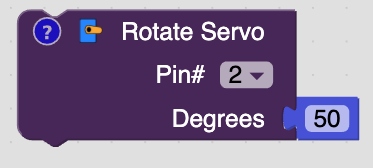

The servo block is used to control a servo. The pin number controls which pin is connected to the Arduino. The degrees hold what position to rotate the servo to.

## Button Setup Block

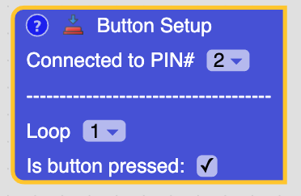

This block is used to tell which pin to use the for push button. Under the dashes you will be able to set when the button is pressed in the virtual circuit.

## Steps

1\. Connect one wire of the push button to (25, E) and the other wire to (27, E) of the breadboard.

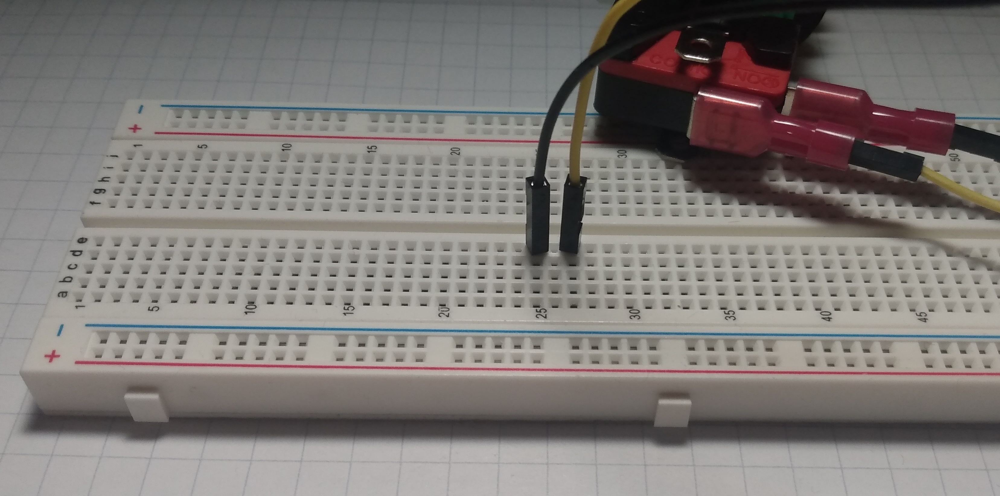

2\. Connect a wire from (25, A) to the - of the breadboard.

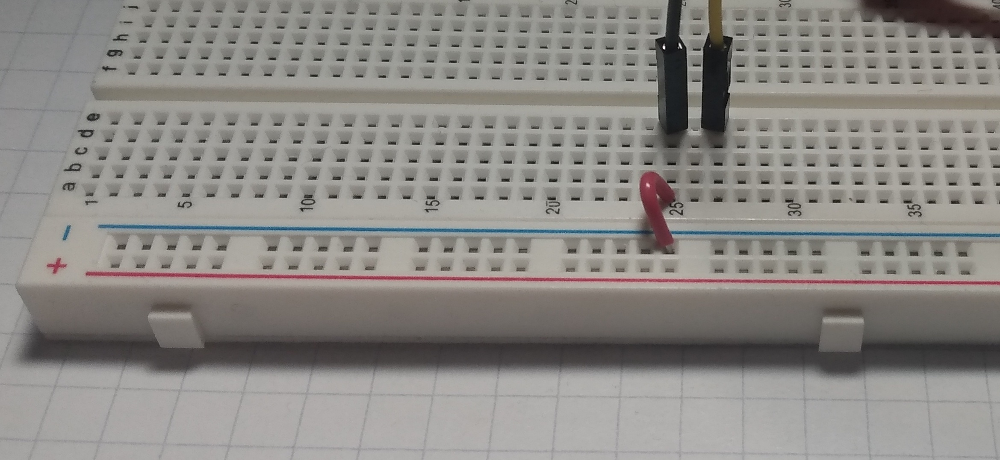

3\. Connect a wire from (27, A) to pin 7 on the Arduino.

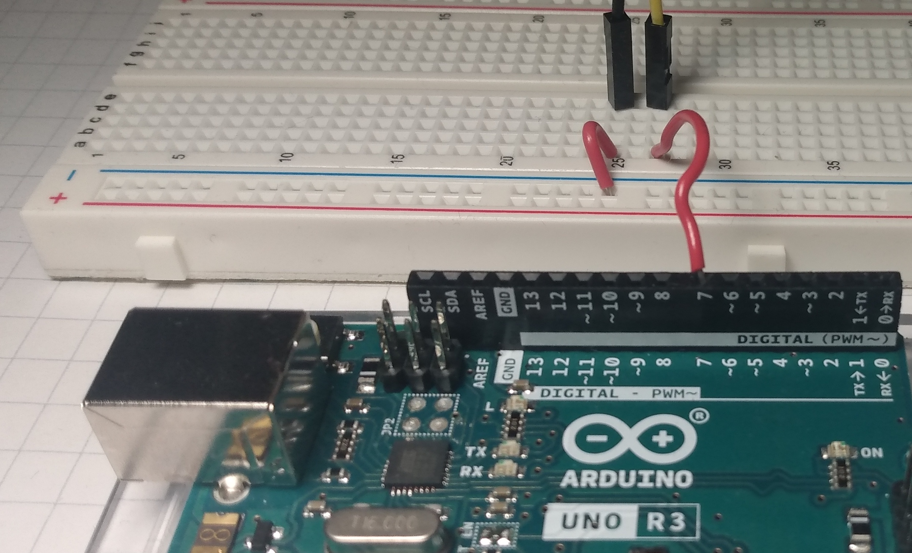

4\. Connect a wire from the data wire (orange) of the servo to (46, E) on the breadboard.

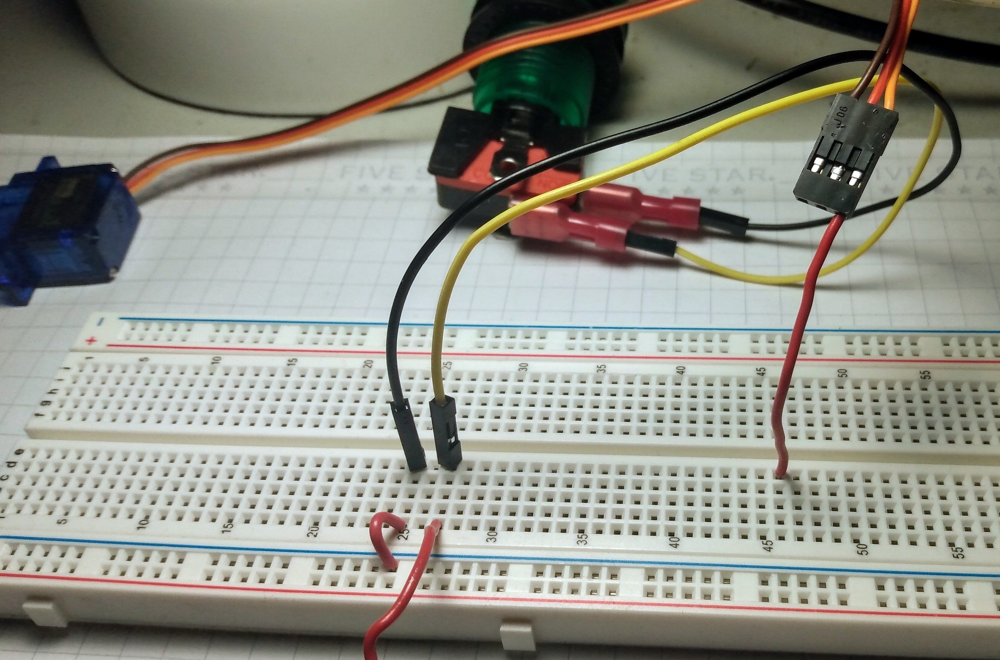

5\. Connect a wire from the volts wire (red) of the servo to (45, E) on the breadboard.

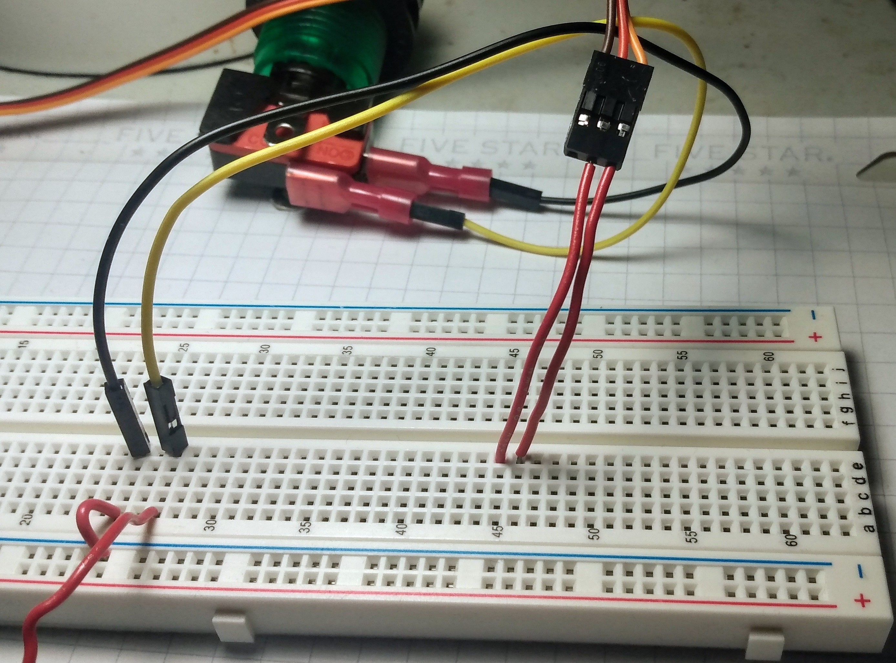

6\. Connect a wire from the ground wire (brown) of the servo to (43, E) on the breadboard.

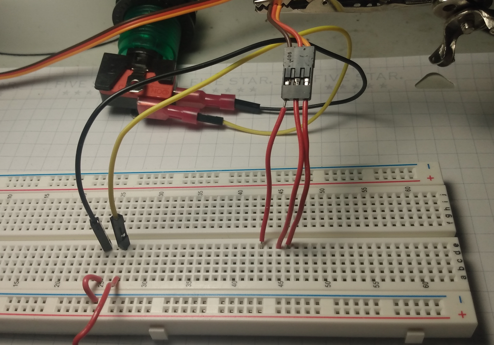

7\. Connect a wire from (43, A) to the - of the breadboard.

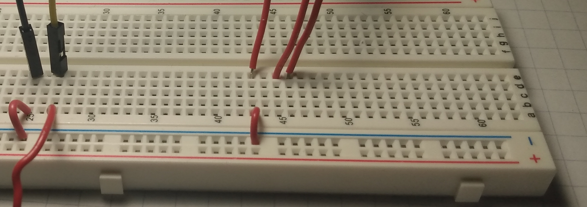

8\. Connect a wire from (45, A) to the + of the breadboard.

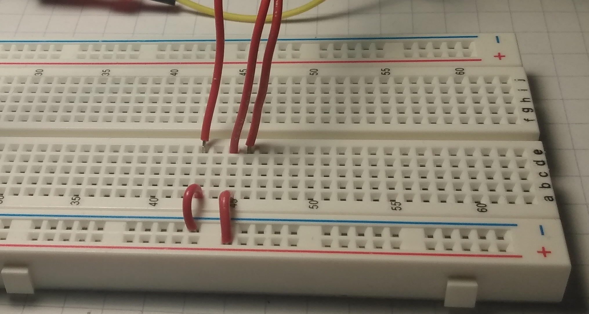

9\. Connect a wire from (46, A) to pin 3 on the Arduino.

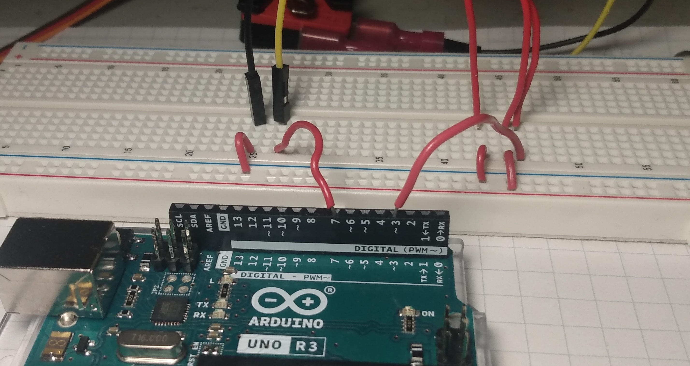

10\. Connect a wire from - on the breadboard to a GND pin on the Arduino.

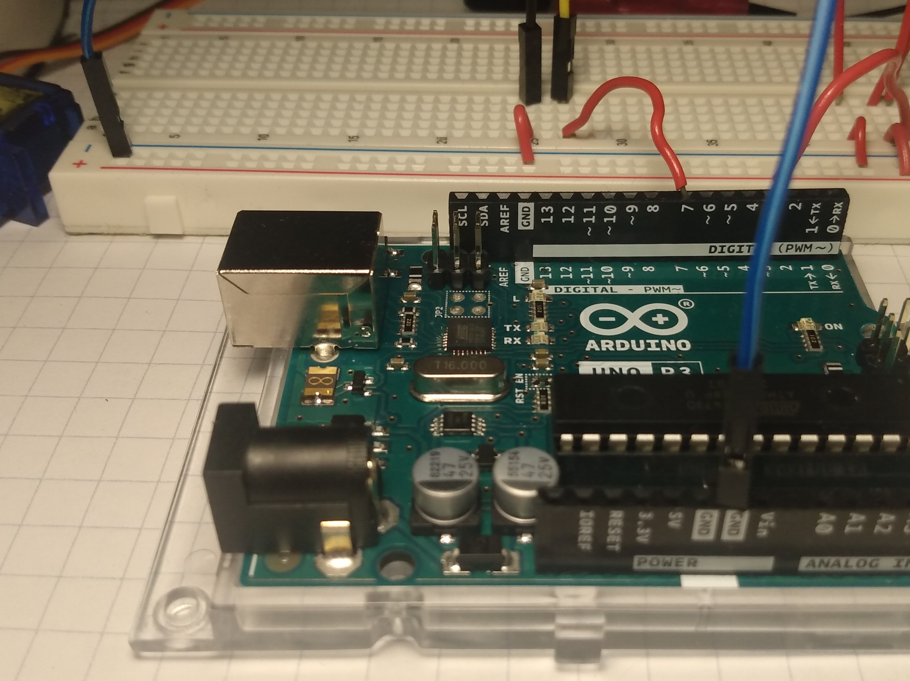

11\. Connect a wire from + on the breadboard to the 5v pin on the Arduino.

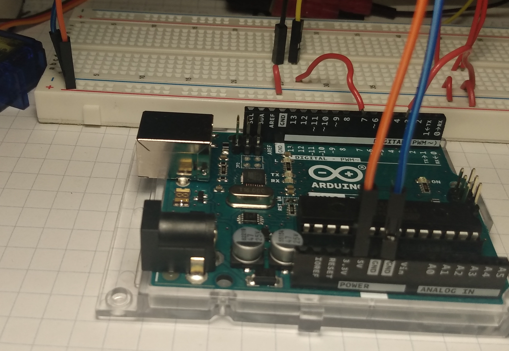

12\. Trace and cut your hand on a piece of posterboard.

13\. Tape the popsicle stick to your posterboard hand.

14\. Tape the popsicle stick to the piece of plastic that connects to the servo. They should create a 90 degree angle with each other.

15\. Tape the servo a table.

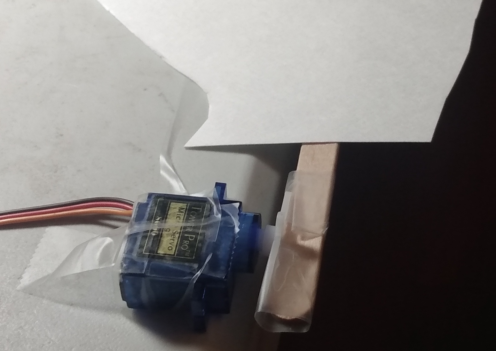

16\. Make sure the popsicle can rotate with the servo.

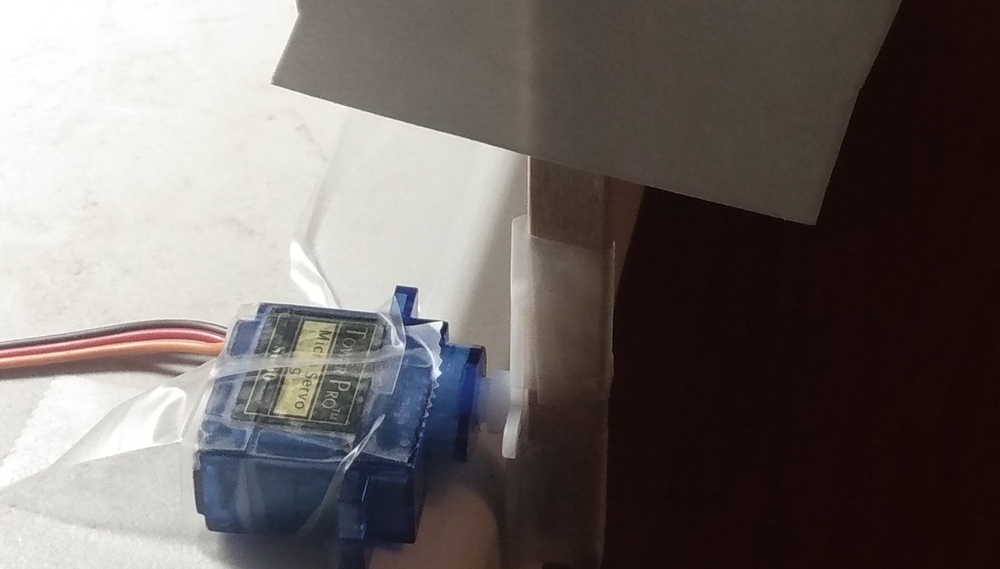

## Coding

<iframe width="535" height="450" src="https://www.youtube.com/embed/RHAePCZokFk?rel=0"  frameborder="0" allow="accelerometer; autoplay; clipboard-write; encrypted-media; gyroscope; picture-in-picture" allowfullscreen></iframe>

## Review

- What is a servo?
- What are if blocks used for?
- What is a button or switch used for?
- Can you use what you learned to write code to make leds turn on and off with a button?
