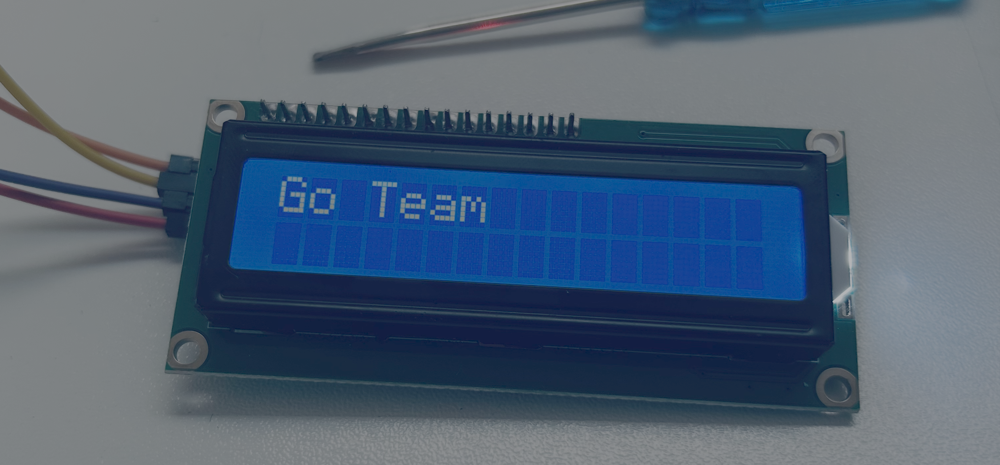
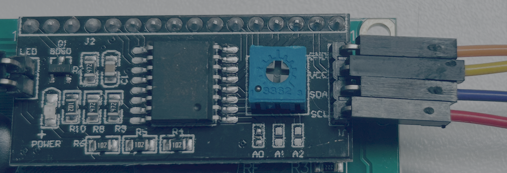
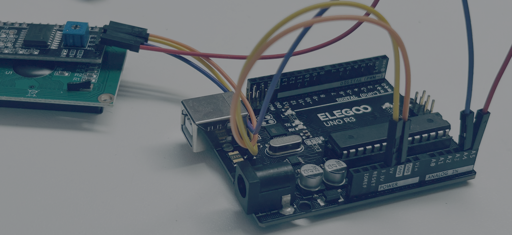
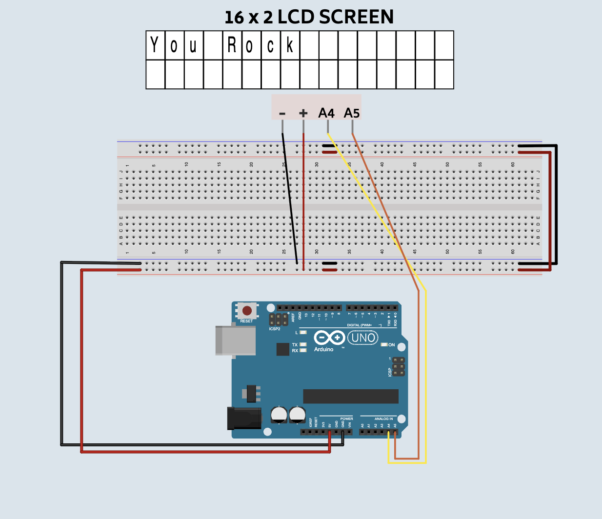

# LCD Screens

## Game Plan!

- How to control and LCD Screen with an Arduino
- Some fun challenges.
- Control the LCD screen from a website.

## What is an LCD Screen.

An LCD screen is a small display that can show words, numbers, and simple messages from an Arduino.

Our LCD screen has 4 pins on the back of it.  A pin is a piece of metal connect to electric device.

## Wiring

Connect 4 jumper wires from the Arduino to the lcd screen.  

| Arduino Pin | LCD Screen |
|-------------|------------|
| A5          | SCL        |
| A4          | SDA        |
| GND         | GND        |
| 5v          | VCC        |

## Print Something Code

<video controls >
<source src="https://storage.googleapis.com/electroblocks/lessons/lcd_screen/lcd_code_simple_print.mp4">
</video>

## Challenges

In this challenge you will make the "Hi" on the screen go back and forth.  Close your current electroblocks window.  Then open a new tab, with this [link](https://electroblocks.org?example_project=lcd_lesson_move_challenge.xml).

- Can you make the word hi on the lcd screen go the end of the screen?

- Can you make your name go to the end of the screen?

## Final Project

<video controls >
<source src="https://storage.googleapis.com/electroblocks/lessons/lcd_screen/lcd_screen_final_project.mp4">
</video>

## Website for the code

To control it from the website be sure to close the electroblocks website.  After that go [LCD site](https://phptuts.github.io/CHM/2026/June/15/index.html) and click on the connect button.  Then type a message and click send.  

## Complete Code

[Starter Challenge Project](../assets/lcd_screen/lcd_lesson_move_challenge.xml)

[Final Project Code](../assets/lcd_screen/lcd_lesson_complete_project.xml)