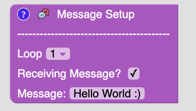
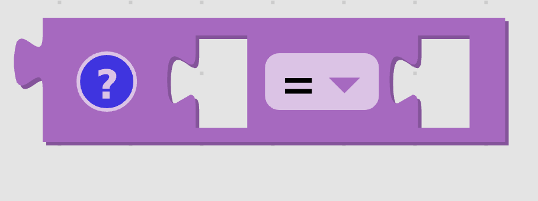

# Messages

## Objective

To also learn about receiving messages from the Arduino.

This lesson requires that you build the circuit in the [blink lesson](blink.md).

## Kit

## Bill of Materials

- 1 x Arduino with cable
- 1 x Breadboard
- 2 x leds
- 2 x resistors (100 - 400 ohms)
- 5 x led wires

## Project

<iframe width="90%" height="700" src="https://www.youtube.com/embed/6oPJVAH-J_I?rel=0"  frameborder="0" allow="accelerometer; autoplay; clipboard-write; encrypted-media; gyroscope; picture-in-picture" allowfullscreen></iframe>

## Video

<iframe width="90%" height="700" src="https://www.youtube.com/embed/qiU27WwjDqk?rel=0"  frameborder="0" allow="accelerometer; autoplay; clipboard-write; encrypted-media; gyroscope; picture-in-picture" allowfullscreen></iframe>

## Message Setup Block

This is a library block that is required for the Arduino to send and receive messages.

Notice the stuff below the "---------------." This where you will tell the virtual Arduino what messages it supposes to receive. The loop dropdown box is used to describe what to receive during which loop. This allows us to test a lot of situations without having an Arduino present.

## If Block

If blocks are used to make decisions. If what is connected to the if part of the block is true then blocks in the do section will run.

## Comparison Block

The comparison block is used to compare two values. If it's set to "=" it will check return true if both blocks connectted to it have the same value.

## Coding it up

<iframe width="90%" height="700" src="https://www.youtube.com/embed/FN0loHPj21Y?rel=0"  frameborder="0" allow="accelerometer; autoplay; clipboard-write; encrypted-media; gyroscope; picture-in-picture" allowfullscreen></iframe>
