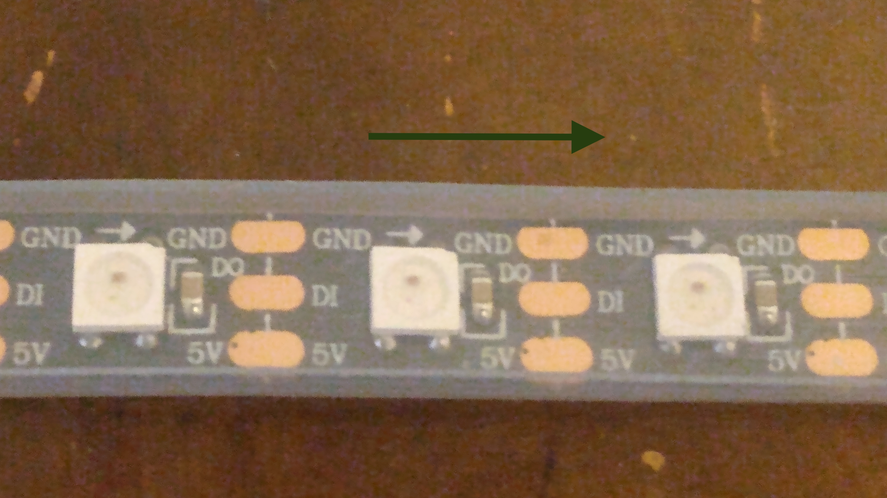
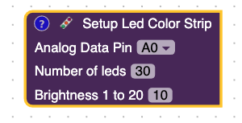
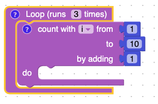
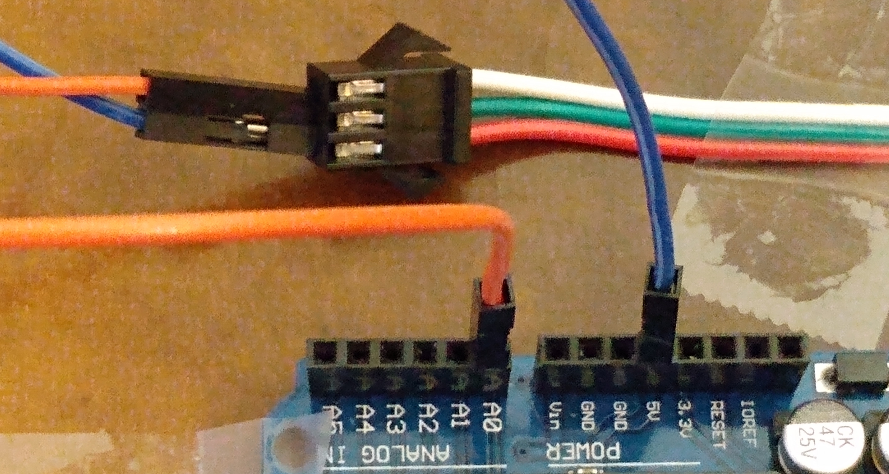
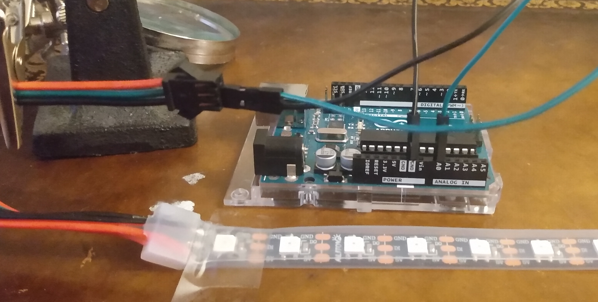
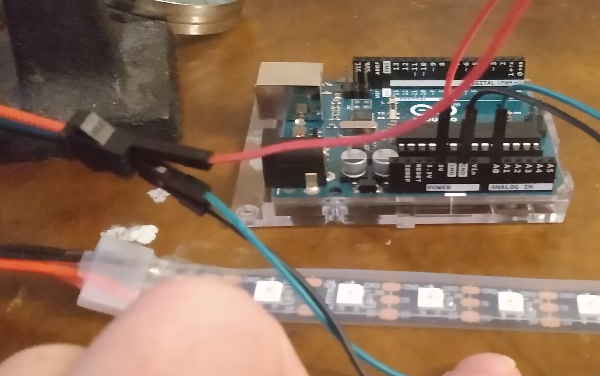

# Neo Pixels

## Objective

To learn how to control rgb led lights (neo pixels) with loops.

## Kit

## Bill of Materials

- Arduino Uno x 1
- RGB LED Light Strip x 1
- Wires x 3

## Project

<iframe width="535" height="450" src="https://www.youtube.com/embed/7PXQAPDPYwY?rel=0"  frameborder="0" allow="accelerometer; autoplay; clipboard-write; encrypted-media; gyroscope; picture-in-picture" allowfullscreen></iframe>

## Video

<iframe width="535" height="450" src="https://www.youtube.com/embed/GvC-PFMKOVk?rel=0"  frameborder="0" allow="accelerometer; autoplay; clipboard-write; encrypted-media; gyroscope; picture-in-picture" allowfullscreen></iframe>

## What are neopixels?

It's a strip of RGB LEDs that are connected. You can control each of the LEDs' color using RGB.

### Arrows

Notice that the metal connecting neopixels are labeled. The DI pin is the pin that will tell the NeoPixels what color to change to. Notice the arrow. The Arduino will connect with the neopixel at the start of the arrows.

## NeoPixel Setup Block

This block is required to set up neopixels. You set the number of LEDs in the strip, the pin used to control the LEDs, and the brightness level between 1 to 20. 20 for maximum brightness.

## Count With Block (loop).

This block will create a number variable that will start at the "from number". In the picture, the variable's name is "i". It will increase or decrease "i" until it equals the to number. You can control the amount that the variable will change by changing the "by adding" number.

## Steps

1\. Place the Arduino so the analog pins are next to the neopixel.

2\. Connect a wire from a GND pin on the Arduino to the GND of the neopixel.

3\. Connect a wire from A0 of the Arduino to data (DI) pin of the neopixel.

4\. Connect a wire from 5v of the Arduino to 5v of the neopixel.

## Test Code

<iframe width="535" height="450" src="https://www.youtube.com/embed/2r-DZJ49qwo?rel=0"  frameborder="0" allow="accelerometer; autoplay; clipboard-write; encrypted-media; gyroscope; picture-in-picture" allowfullscreen></iframe>

## Solid Colors

<iframe width="535" height="450" src="https://www.youtube.com/embed/u6vHqemjLW4?rel=0"  frameborder="0" allow="accelerometer; autoplay; clipboard-write; encrypted-media; gyroscope; picture-in-picture" allowfullscreen></iframe>

## Rainbow Challenge

Try to make a rainbow pattern. I used the colors from this [website](https://www.webnots.com/vibgyor-rainbow-color-codes/) to make the rainbow.

### Solution Video

<iframe width="535" height="450" src="https://www.youtube.com/embed/QpMltfsPRGA?rel=0"  frameborder="0" allow="accelerometer; autoplay; clipboard-write; encrypted-media; gyroscope; picture-in-picture" allowfullscreen></iframe>

## Christmas Light Pattern

<iframe width="535" height="450" src="https://www.youtube.com/embed/PcJtr08FU6A?rel=0"  frameborder="0" allow="accelerometer; autoplay; clipboard-write; encrypted-media; gyroscope; picture-in-picture" allowfullscreen></iframe>

## Snake

<iframe width="535" height="450" src="https://www.youtube.com/embed/famPtOz8qXE?rel=0"  frameborder="0" allow="accelerometer; autoplay; clipboard-write; encrypted-media; gyroscope; picture-in-picture" allowfullscreen></iframe>
