# RGB LED

## What you will learn

- What RGB stands for
- How to change the color of an RGB LED
- How to fade a from one color to another with an RGB LED

## What is RGB

RGB stands for red, green, and blue.  It allows you mix those colors to create custom colors.

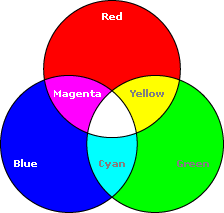

## Bill of Materials

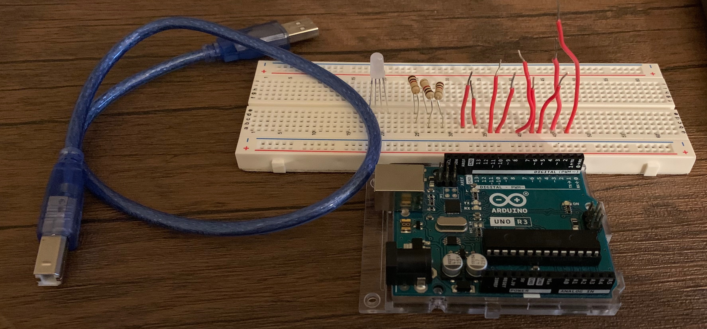

- 1 x [Arduino with cable](../what-is-an-arduino/)
- 1 x [Breadboard](../../addons#breadboard)
- 1 x [RGB LED](../../addons#rgb-led)
- 1 x [Resistors](../../addons#resistor) (1000 ohms)
- 9 x wires

## Blocks

- [RGB LED Setup](../../blocks#rgb-led-setup)
- [RGB LED Set Color](../../blocks#rgb-set-color)
- [Color Picker](../../blocks#color-picker)
- [Color Exact Block](../../blocks#color-exact)
- [Loop with](../../blocks/#loop-with)
- [Get Variable](../../blocks/#get-variable)

## Coding Video

<video controls >
<source src="https://firebasestorage.googleapis.com/v0/b/inapp-tutorial.appspot.com/o/mgMqiXuPbEdHtr6UoPVbQozFQwD2%2FIqveFJLlpwpp9G5A3bbt%2Fstep_CsWMvxDZLqAA0ExQPkh9.mp4?alt=media&token=130724ff-6e65-4740-a2db-446013a0edd3">
</video>

## Wiring Diagram

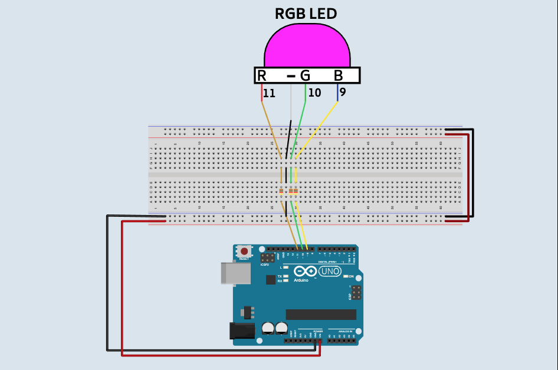

## Steps

1\. Have the front of the Arduino face towards 1 of the breadboard.

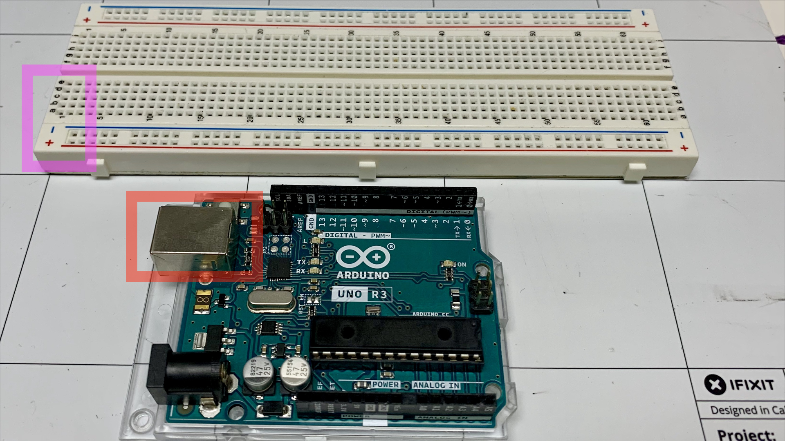

2\. Connect the RGB LED into the breadboard.  

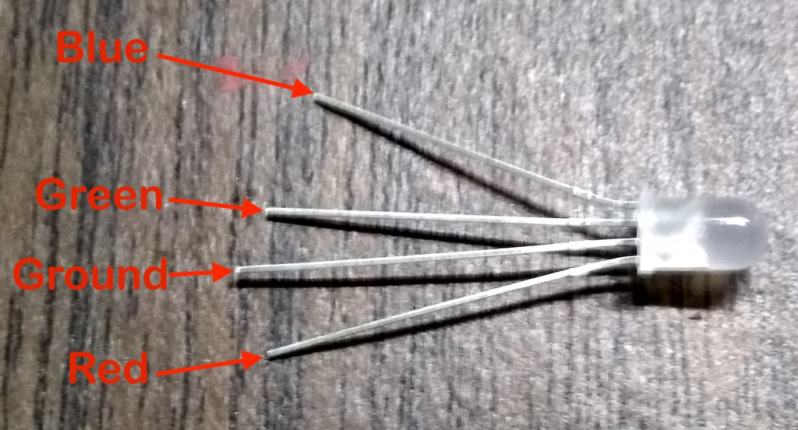

- RED Wire in (27, H)
- GND Wire in (28, H) -- (Longest wire)
- GREEN Wire in (29, H)
- BLUE Wire in (30, H)

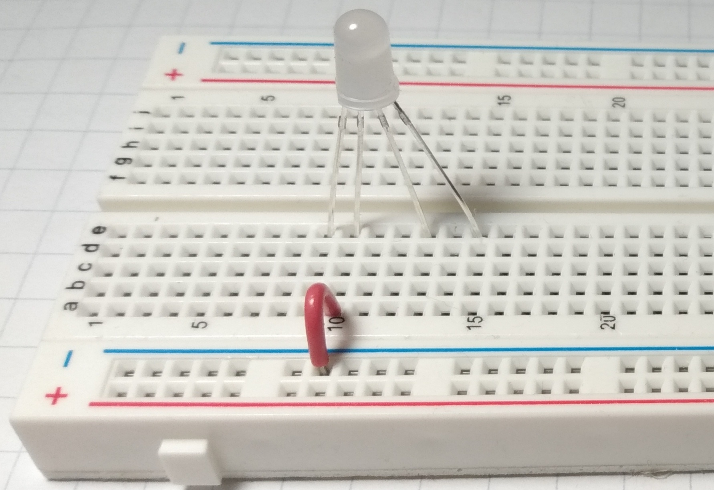

3\. Connect a resistor from (27, F) to (27, E)

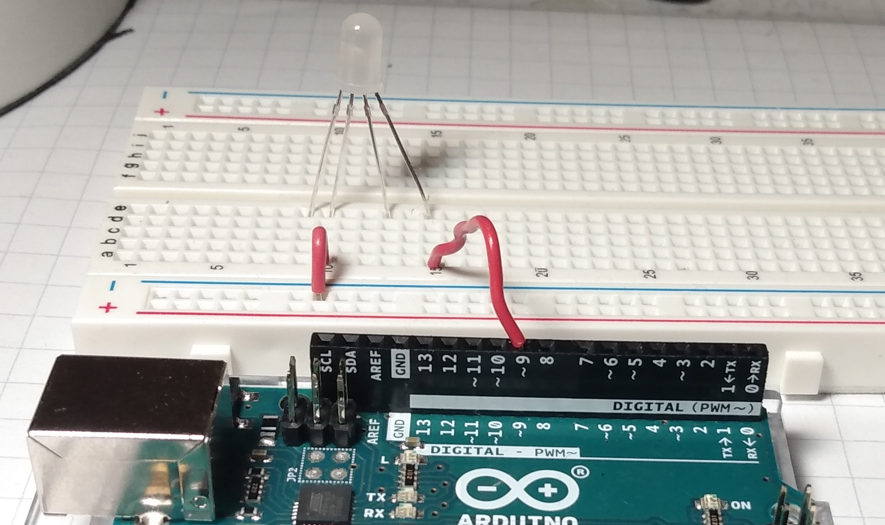

4\. Connect a resistor from (29, F) to (29, E).

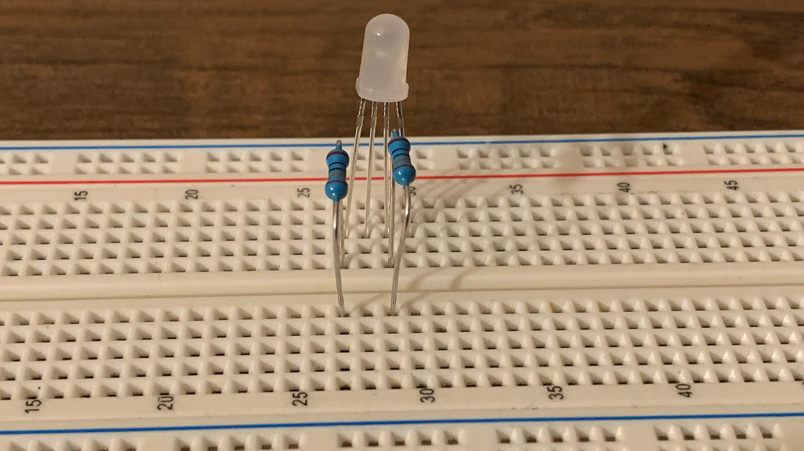

5\. Connect a resistor from (30, F) to (30, E).

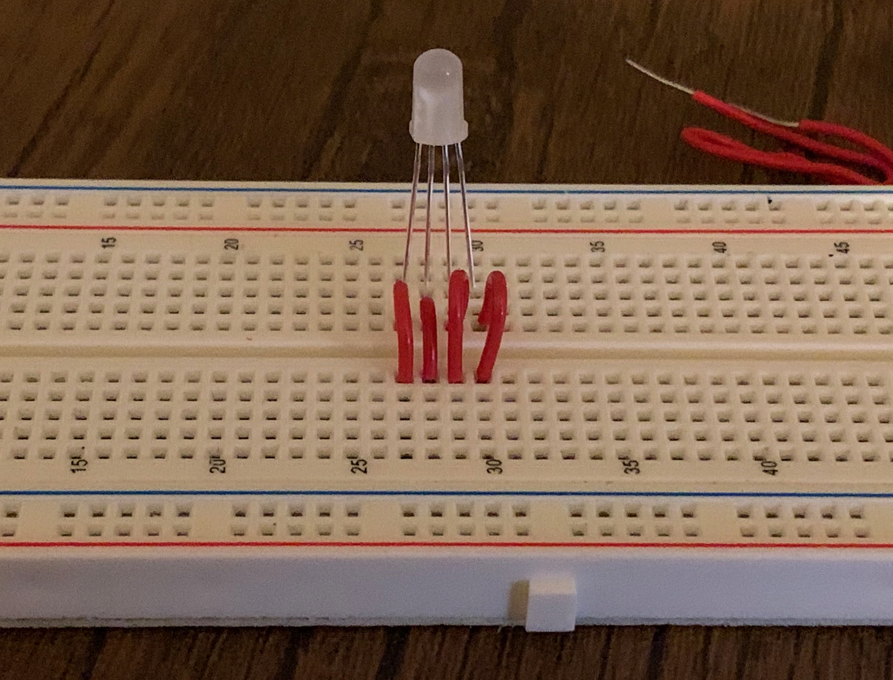

6\. Connect a wire from (28, E) to GND on the breadboard.

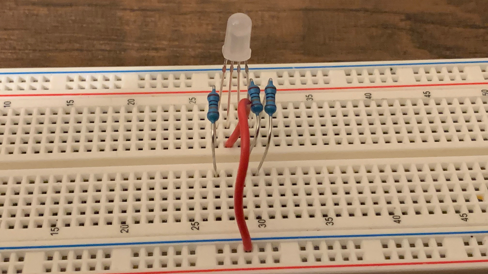

7\. Connect a wire from (27, A) to pin 11 on the Arduino.

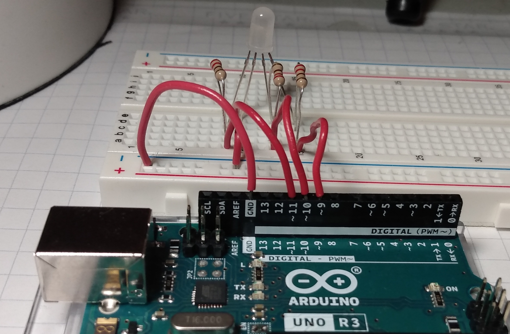

8\. Connect a wire from (29, A) to pin 10 on the Arduino.

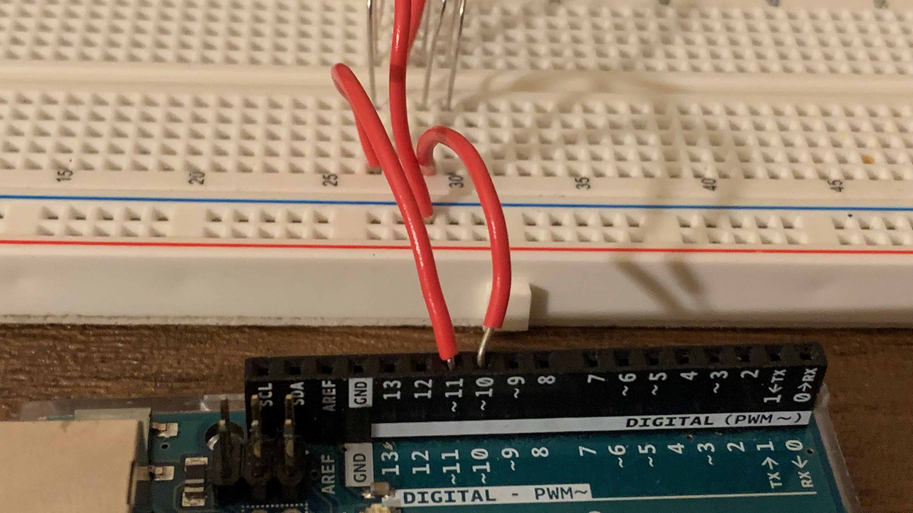

9\. Connect a wire from (30, A) to pin 9 on the Arduino.

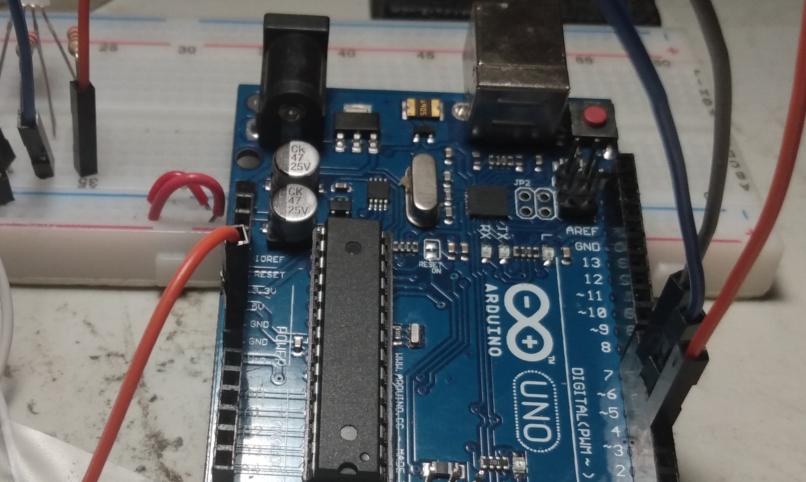

10\. Connect a wire from - of the breadboard to a GND pin on the Arduino.

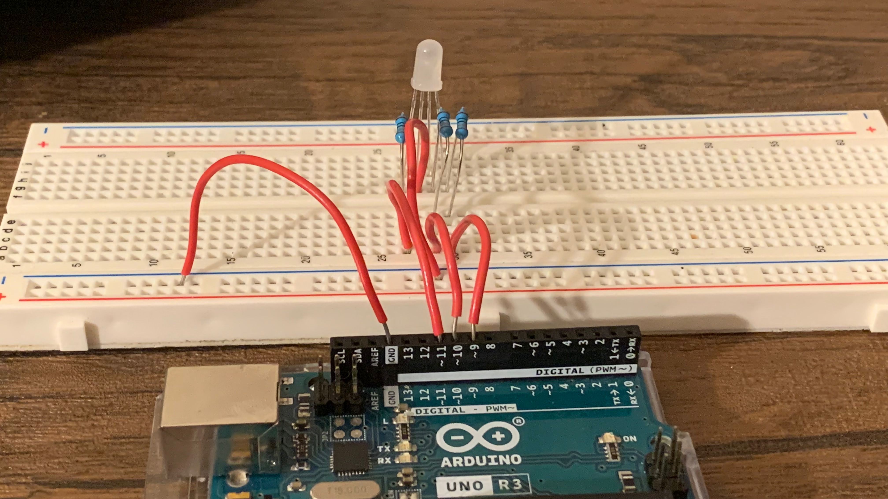

## Challenge

- See if you can send a message to the Arduino and display a color.  An example would be sending "red" and showing red in the RGB LED.
- See if you create another fade.  An example would be purple to blue.

