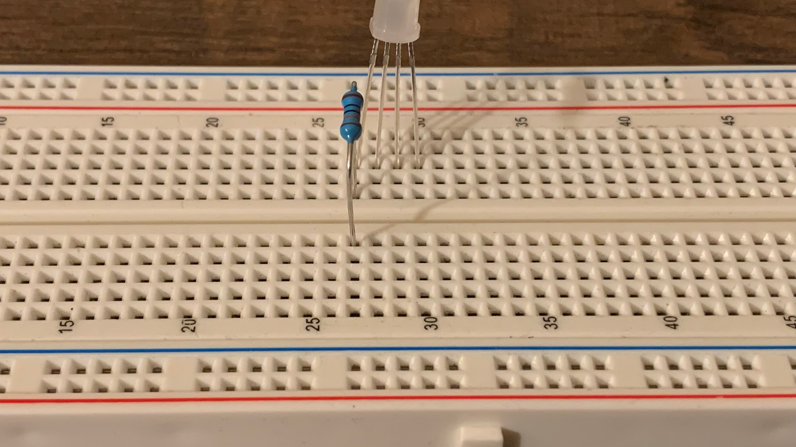
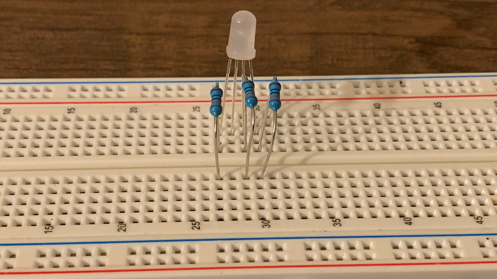
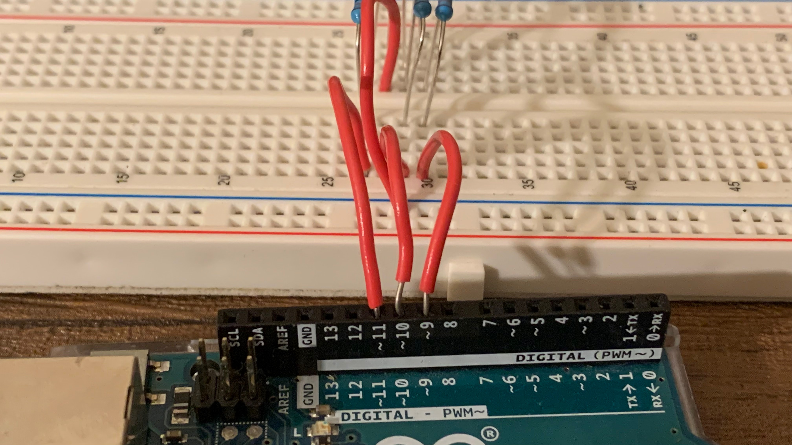

# RGB LED

## Objective

To learn how to control an RGB LED with an Arduino and a computer.

## Kit

## Bill of Materials

- Arduino Uno x 1
- RGB LED x 1
- Jump Wires x 5
- breadboard x 1
- resistors (300 to 1000 ohms) x 3

## What is RGB

RGB stands for red, green and blue. The way it works is that you mix red, green, and blue together to create a color. Click on the input to see an example.

<input type="color">

## What is RGB LED

An rgb led is an led that has 4 wires. One for red, green, and blue, and the other for ground. You send an electrical signal to each color wire to control the amount of each you want. The largest wire is ground.

## Get Part of the text block

This block will take text block and will return a part of it. In the example above the block would return blue. If you wanted it to return red you would change the position to 2.

## Text to number block

This block will change text stored in the computer and convert it into a number. We need this because whenever an Arduino recieves a message it's text.

## Steps

1\. Insert the rgb led into the breadboard. The red wire goes into (42, E). The ground wire goes into (39, E). The green wire goes into (37, E). The blue wire goes into (35, E).

2\. Connect a jumper wire into - of the breadboard to gnd pin of the Arduino.

3\. Connect a resistor into (42, D) and (42, B) of the breadboard.

4\. Connect a jumper wire into (42, A) and the other end into pin 6 of the Arduino.

5\. Connect a jumper wire into (39, A) and the other end into - of the breadboard.

6\. Connect a resistor into (37, D) and (37, B) of the breadboard.

7\. Connect a jumper wire into (37, A) and the other end into pin 5 of the Arduino.

8\. Connect a resistor into (35, D) and (35, B) of the breadboard.

9\. Connect a jumper wire into (35, A) and the other end into pin 3 of the Arduino.

## Testing Wire

<video controls>
  <source src="https://storage.googleapis.com/electroblocks-lessons/rgbled/test-code.mp4" type="video/mp4">
</video>

## Coding

<video controls>
  <source src="https://storage.googleapis.com/electroblocks-lessons/rgbled/rgbled-coding.mp4" type="video/mp4">
</video>
