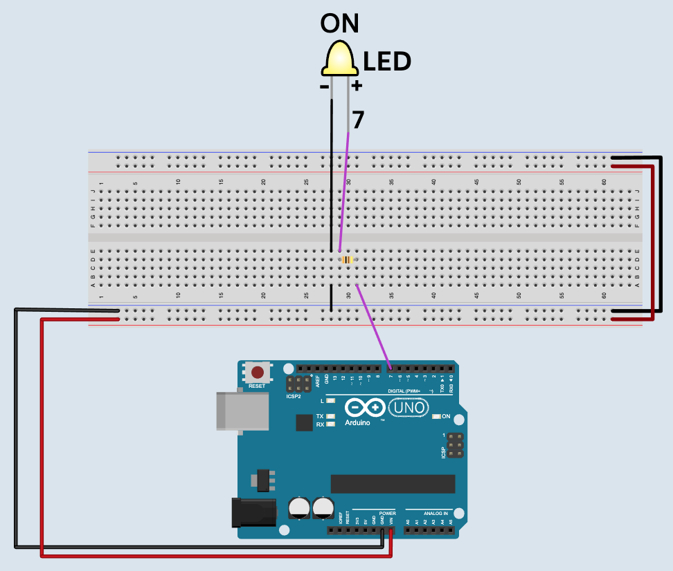

# Sending Messages

## What you will learn

- How to send messages to an Arduino
- How to write code to respond to thoses messages to control an LED

## Bill of Materials

- 1 x [Arduino with cable](../what-is-an-arduino/)
- 1 x [Breadboard](../../addons#breadboard)
- 1 x [Leds](../../addons#led)
- 1 x [Resistors](../../addons#resistor) (100 - 400 ohms)
- 4 x wires

## Blocks

- [Arduino Message Setup](../../blocks#arduino-message-setup)
- [Arduino Get Message](../../blocks#arduino-get-message)
- [Compare Block](../../blocks#compare)
- [If](../../blocks#if)
- [Led](../../blocks#led)

## Coding Video

<video controls >
<source src="https://firebasestorage.googleapis.com/v0/b/inapp-tutorial.appspot.com/o/electroblocks-org%2FV6DvaFUt1LsXJoNCkBEe%2Fstep_BG5g6G5DbxCUt8JjV63E.mp4?alt=media&token=e73ddfd7-3c0d-4964-bcee-383cc62f0562">
</video>

## Wiring Diagram

## Steps

The steps for sending message are the same steps for wiring the first led in [blink lesson](../blink/#steps-first-led).

## Challenge

See if you can wire up another LED and come up with a message that can make it go on and off.
