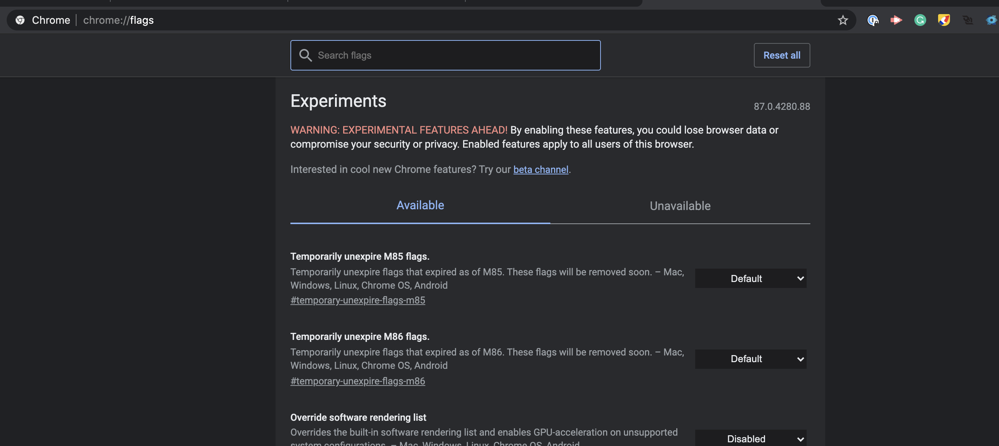

# Setting up chrome

In order to get chrome working you will need to turn on some flags. At the time of the writing it's not possible to do this with firefox.

## Video

<iframe width="535" height="450" src="https://www.youtube.com/embed/NEgdfx_VqDE?rel=0"  frameborder="0" allow="accelerometer; autoplay; clipboard-write; encrypted-media; gyroscope; picture-in-picture" allowfullscreen></iframe>

## Steps

1\. Go to chrome://flags in your chrome browser

2\. In the search bar type in 'Experimental Web Platform features'

3\. Enable the feature and click the relaunch button at the bottom of your screen.

