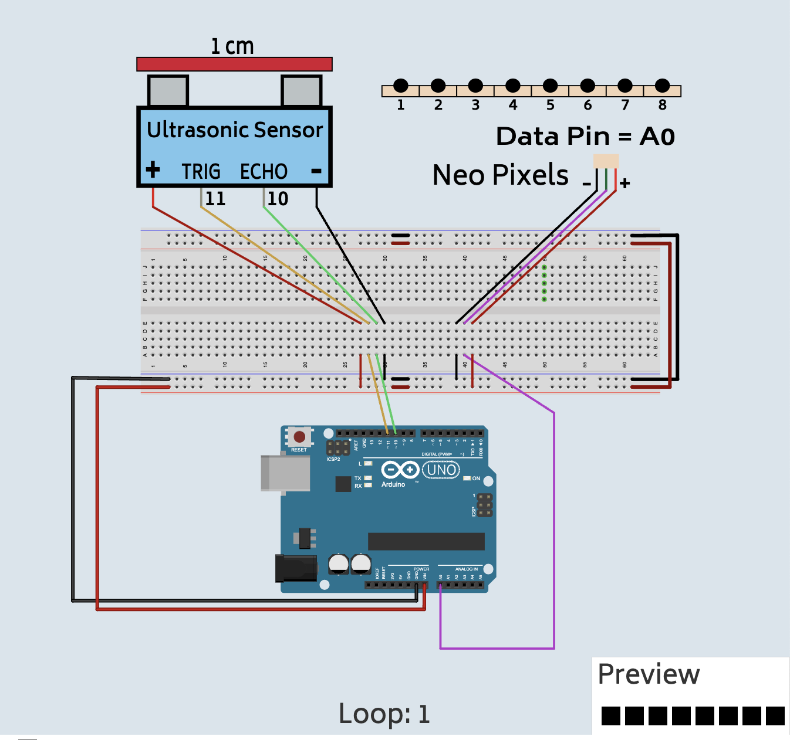

# Sonar Motion Sensor with RGB LED Light Strip

## What you will learn

- How to use an ultrasonic sensor for measuring the distance
- How to RGB LED Light Strip

## Bill of Materials

- 1 x [Arduino with cable](../what-is-an-arduino/)
- 1 x [Breadboard](../../addons#breadboard)
- 1 x RGB LED Light Strip
- 1 x UltraSonic Sensor
- 10 x wires

## Coding Examples

[Motion Sensor](http://localhost:5173/?example_project=sonar_rgbleds.xml)

[Spinning Colors](http://localhost:5173/?example_project=sonar_rgbleds_spin.xml)

## Wiring Diagram

## Steps First LED

1\. Connect the wire labeld GND to the GND Pin of the Arduino.

2\. Connect the + wire to VIN Pin.

3\. Connect the Data wire to the A0 pin.

4\. Connect the ECHO wire to pin 10 of the Arduino.

5\. Connect the TRIG wire to pin 11 of the Arduino.

## Review

- What is an ultrasonic sensor?
- What cool things can you make with it?
- What is RGB mean?
- What is an RGB LED Light Strip?