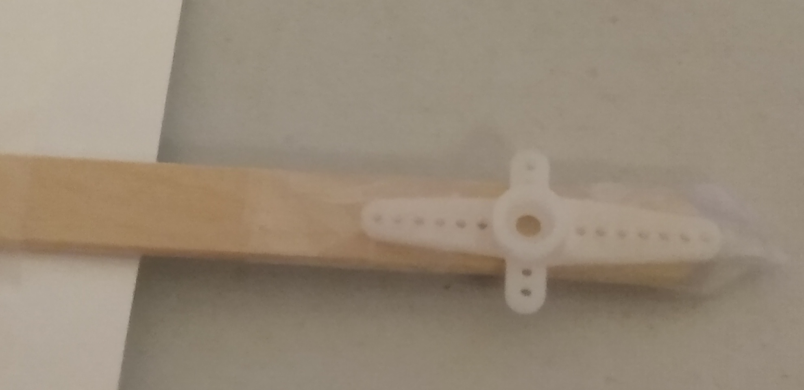
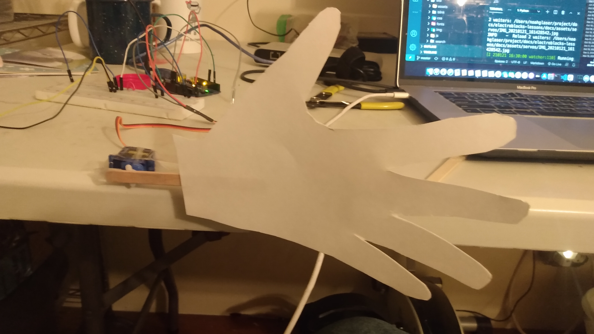

# Wave

## Objective

To learn how to build a wave machine with the servo.

## Bill of Materials

- Arduino Uno x 1
- Servo x 1
- Push Button x 1
- Jump Wires x 10
- breadboard x 1
- Posterboard
- Popsicle Stick
- Tape

## Project

<iframe width="535" height="450" src="https://www.youtube.com/embed/vwD849lvyxg?rel=0"  frameborder="0" allow="accelerometer; autoplay; clipboard-write; encrypted-media; gyroscope; picture-in-picture" allowfullscreen></iframe>

## Video

<iframe width="535" height="450" src="https://www.youtube.com/embed/IqCjfNvi-28?rel=0"  frameborder="0" allow="accelerometer; autoplay; clipboard-write; encrypted-media; gyroscope; picture-in-picture" allowfullscreen></iframe>

## What is a variable?

A variable is how the computer stores information that can change. The information that it stores is called its value. The way you get the value that a variable store is by using the get variable block and its name. A variable also has a type of data that it stores. In Electroblocks there are 4 types:

- Text
- Numbers
- Boolean (true or false)
- Color

## Steps

1\. Tape the popsicle stick to the piece of plastic that connects to the servo. They should be parallel with each other.

2\. Reattach the plastic piece to the servo.

## Coding

<iframe width="535" height="450" src="https://www.youtube.com/embed/U-4OIAiFSXw?rel=0"  frameborder="0" allow="accelerometer; autoplay; clipboard-write; encrypted-media; gyroscope; picture-in-picture" allowfullscreen></iframe>

## Challenge

Write code so that only when the button is pressed does the wave.

<iframe width="535" height="450" src="https://www.youtube.com/embed/o6D0_ERKuVQ?rel=0"  frameborder="0" allow="accelerometer; autoplay; clipboard-write; encrypted-media; gyroscope; picture-in-picture" allowfullscreen></iframe>
