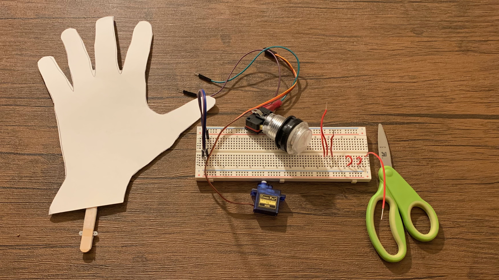

# Wave

## What you will learn

- How to build a wave machine
- How to use a count with block to make something repeat

## Bill of Materials

- 1 x [Arduino with cable](../what-is-an-arduino/)
- 1 x [Breadboard](../../addons#breadboard)
- 1 x [Push Button](../../addons/#push-buttons)
- 1 x [Servo](../../addons/#servos)
- 1 x posterboard
- 1 x scissor
- 7 x wires

## Blocks

- [Loop with](../../blocks/#loop-with)
- [Get Variable](../../blocks/#get-variable)
- [Servo](../../blocks#servo)
- [Wait](../../blocks#wait)
- [If](../../blocks#if)
- [Button Setup](../../blocks#button-setup)
- [Is Button Pressed](../../blocks#is-button-pressed)

## Wiring Diagram

## Coding Video

<video controls >
<source src="https://firebasestorage.googleapis.com/v0/b/inapp-tutorial.appspot.com/o/mgMqiXuPbEdHtr6UoPVbQozFQwD2%2FLcfZgIxY57HX1xAC8ER0%2Fstep_AyQ3MJbSC3zpVWGpgprd.mp4?alt=media&token=88566ef5-89f4-4dfd-9512-1c67ebfcb65c">
</video>

## Steps

The steps for wave machine are the same steps for building [high five machine](../highfive/#building-highfive-machine)