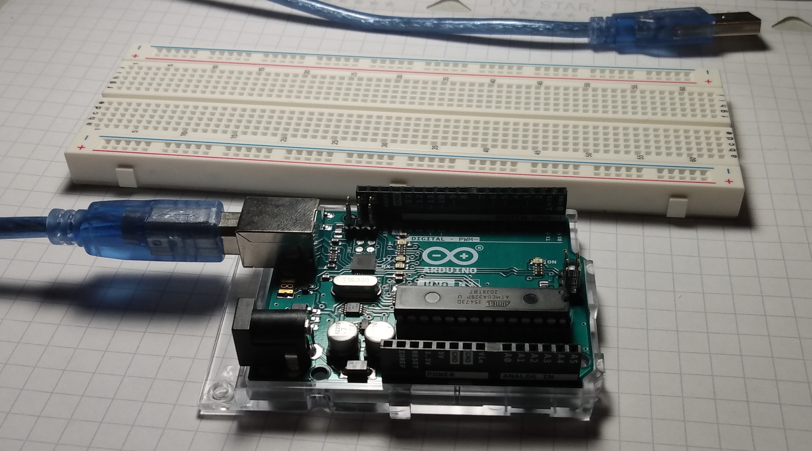
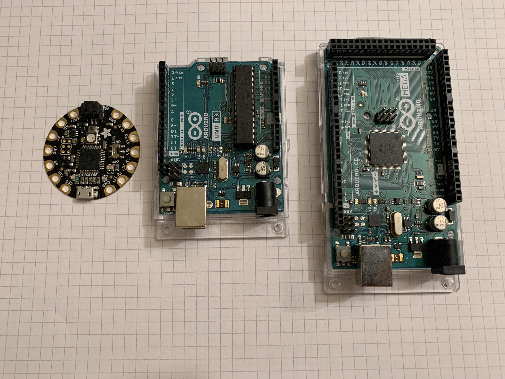
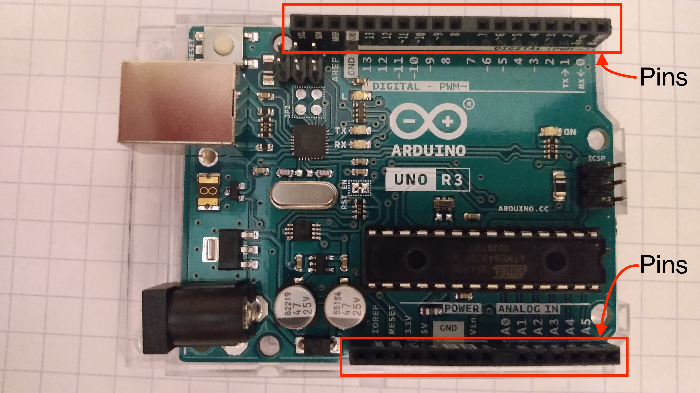
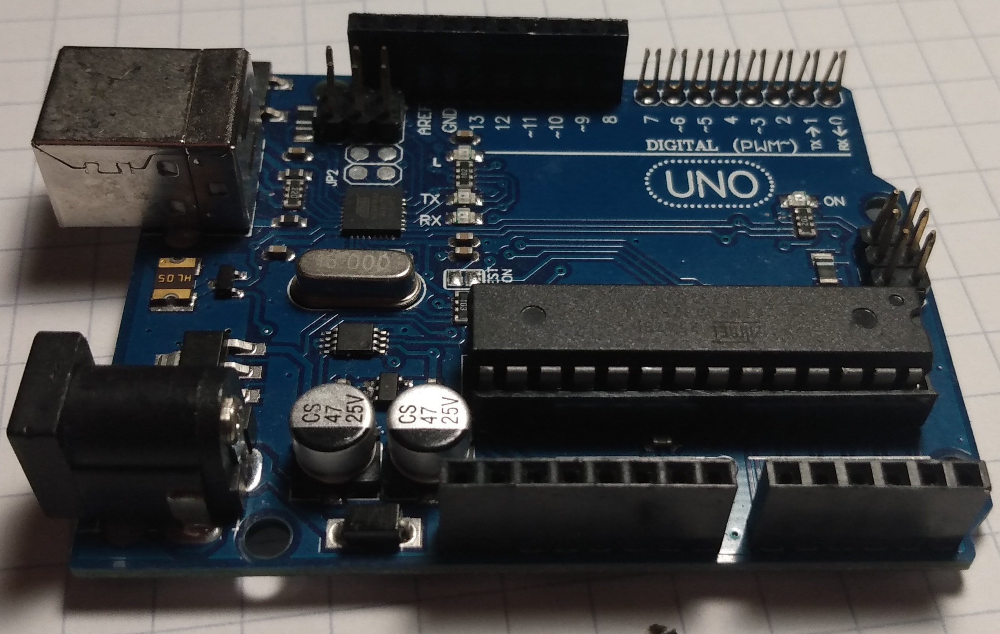
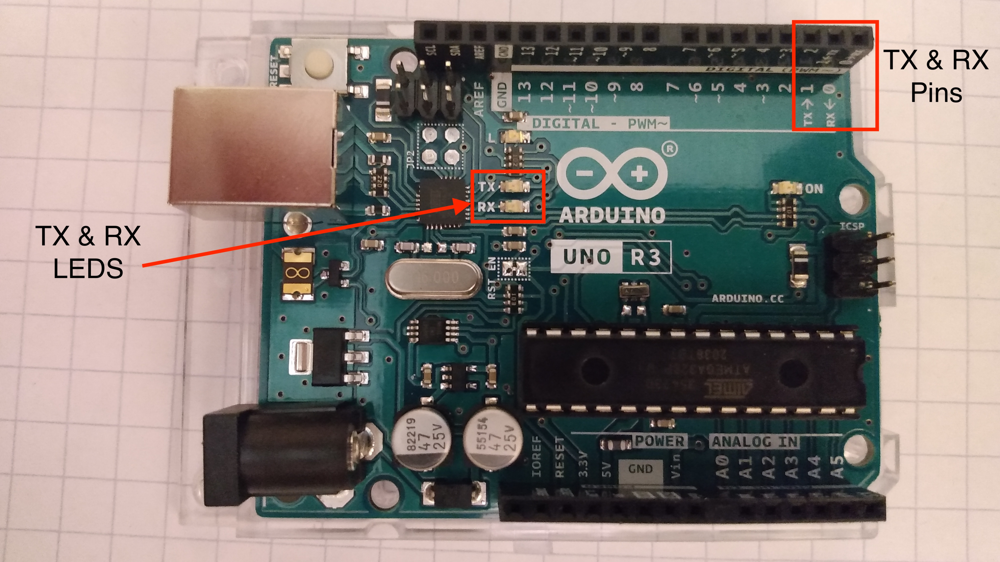
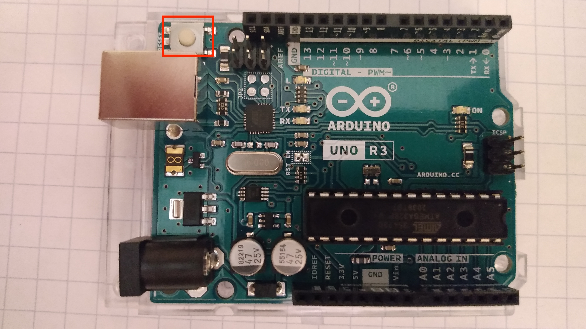
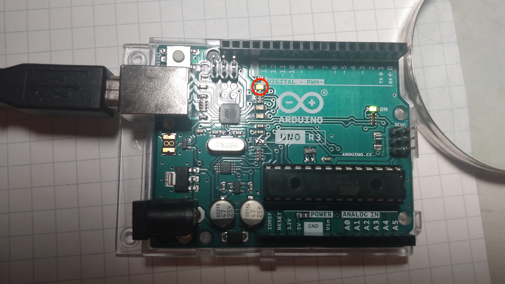

# What is an Arduino?

## Objective

To learn what an Arduino is and some of the parts of an Arduino?

## Kit

## Bill of Materials

- 1 x Arduino with cable

## Video

<iframe width="535" height="450" src="https://www.youtube.com/embed/xqGvigvGlYY?rel=0"  frameborder="0" allow="accelerometer; autoplay; clipboard-write; encrypted-media; gyroscope; picture-in-picture" allowfullscreen></iframe>

## What is an Arduino?

An Arduino is a type of computer. The main advantage of Arduino is that they make it easy to build electronic projects. Arduino comes in many shapes and sizes. In the course, we'll mainly be using the Arduino Uno.

### What are pins?

Pins are the pieces of metal that stick out of the Arduino. They are covered with plastic. With code, you can make a pin an input pin or an output pin.

Input pins sense whether electricity is running through the pin. Output pins turn on and off electricity. Input pins are often used for sensors, while output pins are often used to control electrical components like LEDs, motors, and LCD screens.

### Where is the Arduino's brain?

### What are the RX and TX leds and pins?

These pins are used to receive and transmit messages to and from the Arduino. Whenever a message is being sent from the Arduino, the TX LED lights up. Whenever a message is being received, the RX led lights up.

### Reset Button (reloads the program)

This will restart the Arduino with the code that is already on it.

### Internal Led

This led is built into the Arduino. It will light up when pin 13 is turned on.

