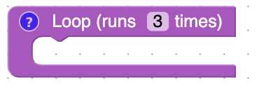
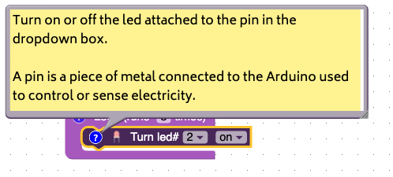
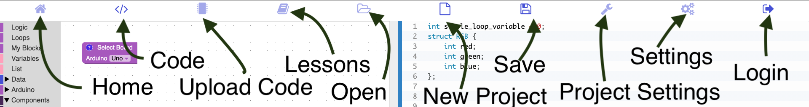

# What is ElectroBlocks?

<iframe width="90%" height="700" src="https://www.youtube.com/embed/7zi0rAH8sxU?rel=0"  frameborder="0" allow="accelerometer; autoplay; clipboard-write; encrypted-media; gyroscope; picture-in-picture" allowfullscreen></iframe>

ElectroBlocks is a website the allows you to write code for the Arduino by dragging and dropping blocks onto the screen. It creates a virtual circuit and allows you to step through the code, one block at a time.

## Board Selector Block

<iframe width="90%" height="700" src="https://www.youtube.com/embed/LiecZECeiXg?rel=0"  frameborder="0" allow="accelerometer; autoplay; clipboard-write; encrypted-media; gyroscope; picture-in-picture" allowfullscreen></iframe>

This block is always present. It allows you to switch between the different types of Arduinos.

## Loop Block

This block will run forever on a real Arduino, but will only run 3 times through the virtual circuit. What this means is that all the blocks inside the loop block will run 3 times. You can change this number to whatever positive number you want.

## Building a circuit

<iframe width="90%" height="700" src="https://www.youtube.com/embed/SXRAHp0-yEA?rel=0"  frameborder="0" allow="accelerometer; autoplay; clipboard-write; encrypted-media; gyroscope; picture-in-picture" allowfullscreen></iframe>

As you drag blocks into the loop block the circuit starts to update.

## Question about a block?

If you have a question about a block click on the question mark.

## Navbar

