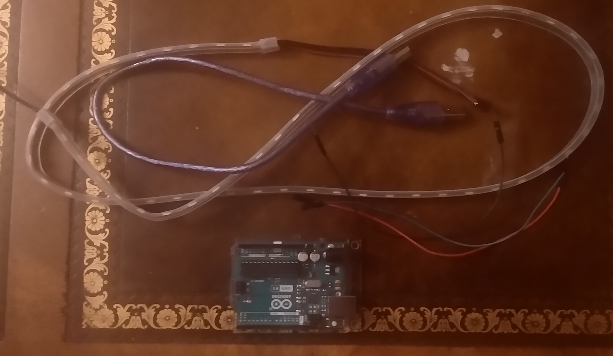

# Neo Pixels

## Objective

To learn how to control rgb led lights (neo pixels) with loops.

## Kit

## Bill of Materials

- Arduino Uno x 1
- RGB LED Light Strip
- Jump Wires x 3

## What is are neopixels / rgb led light strip?

It's a bunch of rgb leds that are connected together. You can control each of the leds color using rgb. Note please buy 5 volt rgb leds that work with the Arduino.
