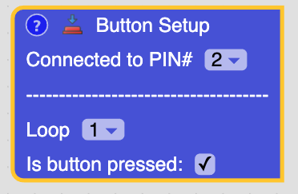

# Lesson 3 - Servos

## Objective

To learn how to use a servo and buttons by building fun projects.

## Bill of Materials

- Arduino Uno x 1
- Servo x 1
- Push Button x 1
- Jump Wires x 3

## What is a servo

<video controls>
  <source src="../assets/servos/servo-demo.mp4" type="video/mp4">
</video>

A servo is a motor that allows you to control the exact rotation. You do this by telling the Arduino how many degrees to rotate it.

## What is a push button or switch

A button or switch is a component that allows you to control whether electricity flows through it. It allows you to turn on and off the electricity.

## Servo Block

The servo block is used to control a servo. The pin number controls which pin is connectted to the Arduino. The degrees controls what position of the servo.

## Button Setup Block

This block is used to tell which pin to use the for push button. Under the dashes you will be able to set when the button is pressed in the virtual circuit.

## Steps

1\.
