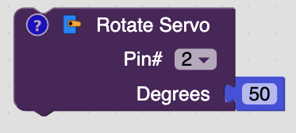
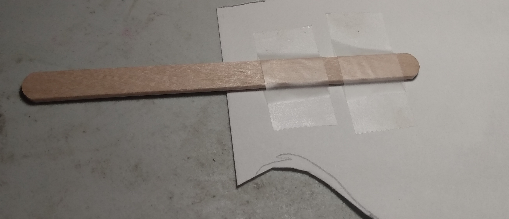
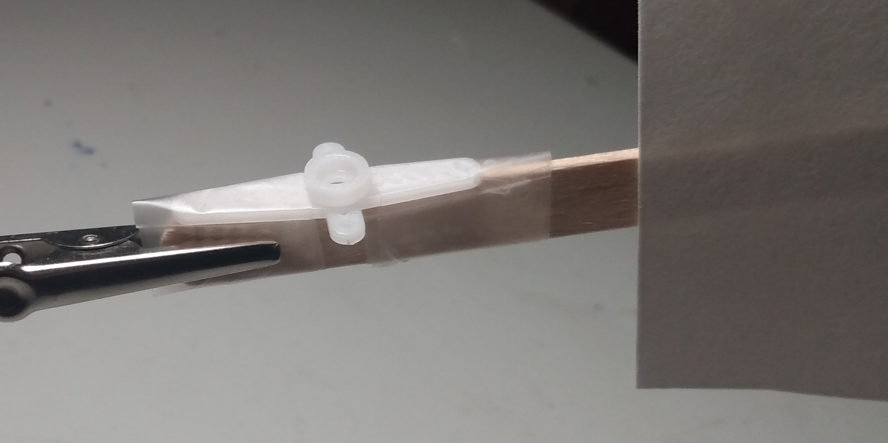
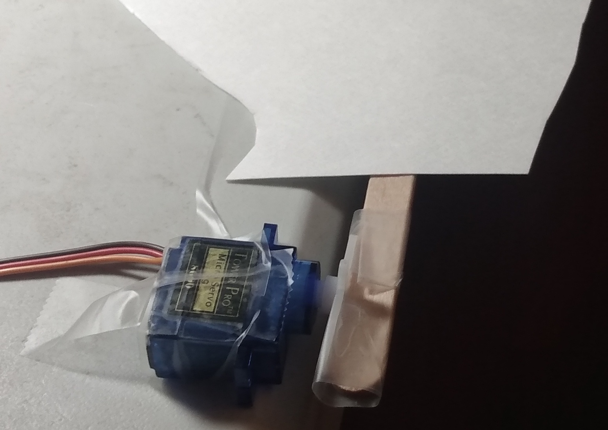
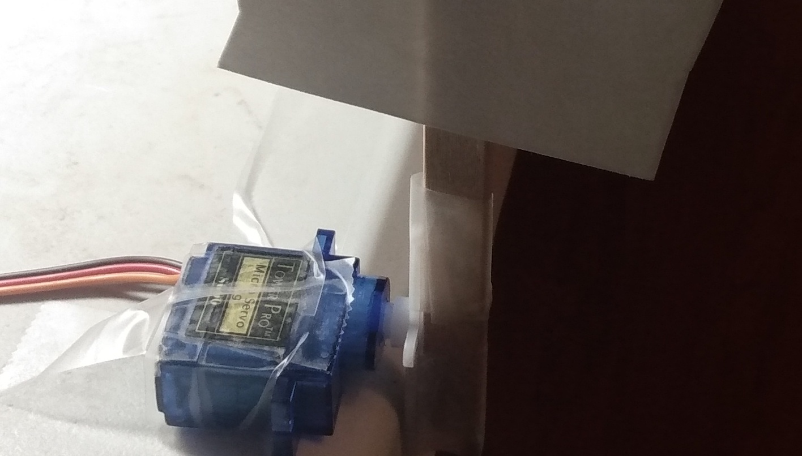

# Lesson 3 - Servos

## Objective

To learn how to use a servo and buttons by building fun projects.

## Bill of Materials

- Arduino Uno x 1
- Servo x 1
- Push Button x 1
- Jump Wires x 3

## What is a servo

<video controls>
  <source src="../assets/servos/servo-demo.mp4" type="video/mp4">
</video>

A servo is a motor that allows you to control the exact rotation. You do this by telling the Arduino how many degrees to rotate it.

## What is a push button or switch

A button or switch is a component that allows you to control whether electricity flows through it. It allows you to turn on and off the electricity.

## Servo Block

The servo block is used to control a servo. The pin number controls which pin is connectted to the Arduino. The degrees controls what position of the servo.

## Button Setup Block

This block is used to tell which pin to use the for push button. Under the dashes you will be able to set when the button is pressed in the virtual circuit.

## Create Block

This is used to create your own blocks. You can put blocks inside the create block and they will run when you use the block you created.

## What is a variable?

A variable is how the computer stores information that can change. The information that it stores is called it's value. The way you get value that a variable stores is by using the get variable block and it's name. A variable also as a type of data that it stores. In Electroblocks there are 4 types:

- Text
- Numbers
- Boolean (true or false)
- Color

## Wiring Steps

1\. Connect one end of the jumper wire into GND of the Arduino and the other end into - of the breadboard.

2\. Connect one end of the jumper wire into 5v of the Arduino and the other end into + of the breadboard.

3\. Connect one end of the jumper wire into (25, A) and the other end into - of the breadboard.

4\. Connect one of the wires connected to the button into (25, E).

5\. Connect the other of the wire connected to the button into (27, E).

6\. Connect one end of the jumper wire into (27, A) and the other end into pin 7 of the Arduino.

7\. Connect one end of the jumper wire into (46, E) and the other end into data wire (orange) of the servo.

8\. Connect one end of the jumper wire into (46, A) and the other end into pin 3 of the Arduino.

9\. Connect one end of the jumper wire into + of the breadboard and the other end into power wire (red) of the servo.

10\. Connect one end of the jumper wire into - of the breadboard and the other end into ground wire (brown) of the servo.

11\. Draw you hand on a piece of posterboard.

12\. Cut it out.

13\. Tape it to the popsicle stick.

14\. Tape the popsicle stick to the plastic piece. Try to create a 90 degree angle like the picture.

15\. Tape both sides.

16\. Tape down the servo.

17\. Make sure the servo can rotate the hand up and down.

## Coding High Five Machine

<video controls>
  <source src="../assets/servos/coding-high-five.mp4" type="video/mp4">
</video>

<video controls>
  <source src="../assets/servos/highfive.mp4" type="video/mp4">
</video>
