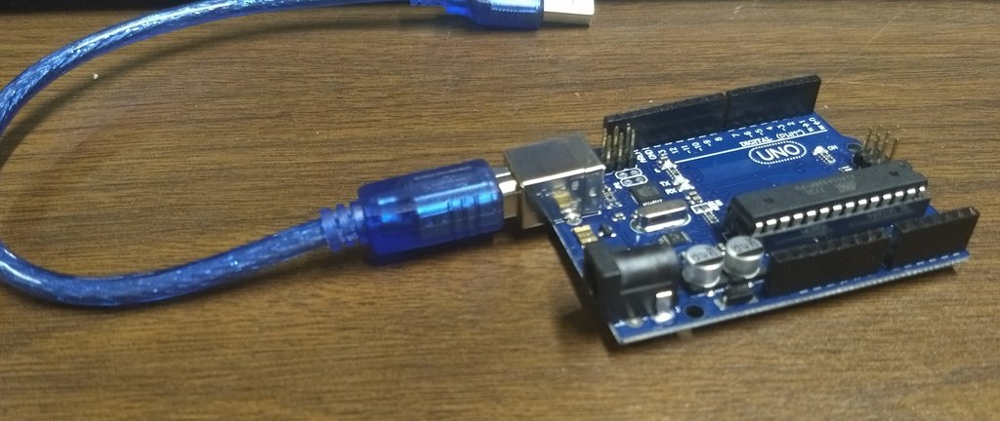
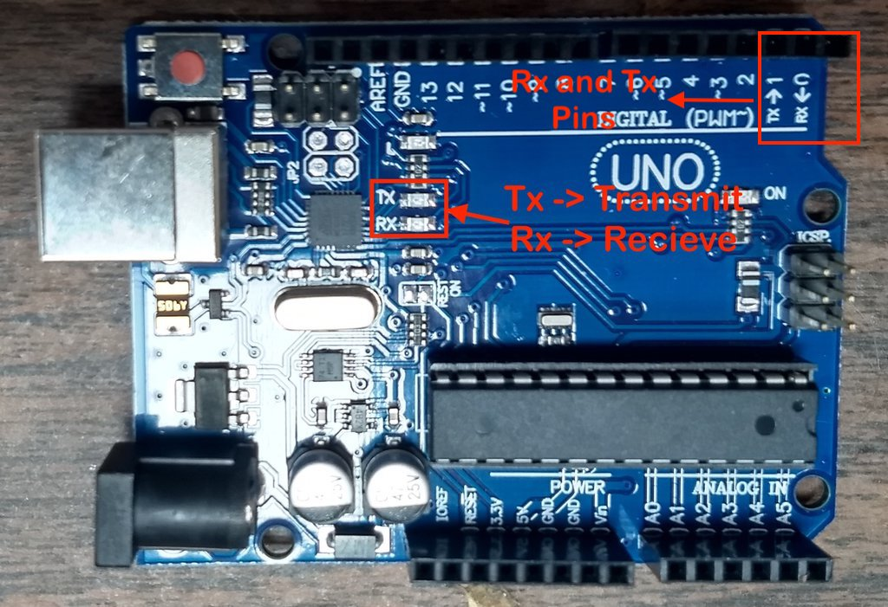
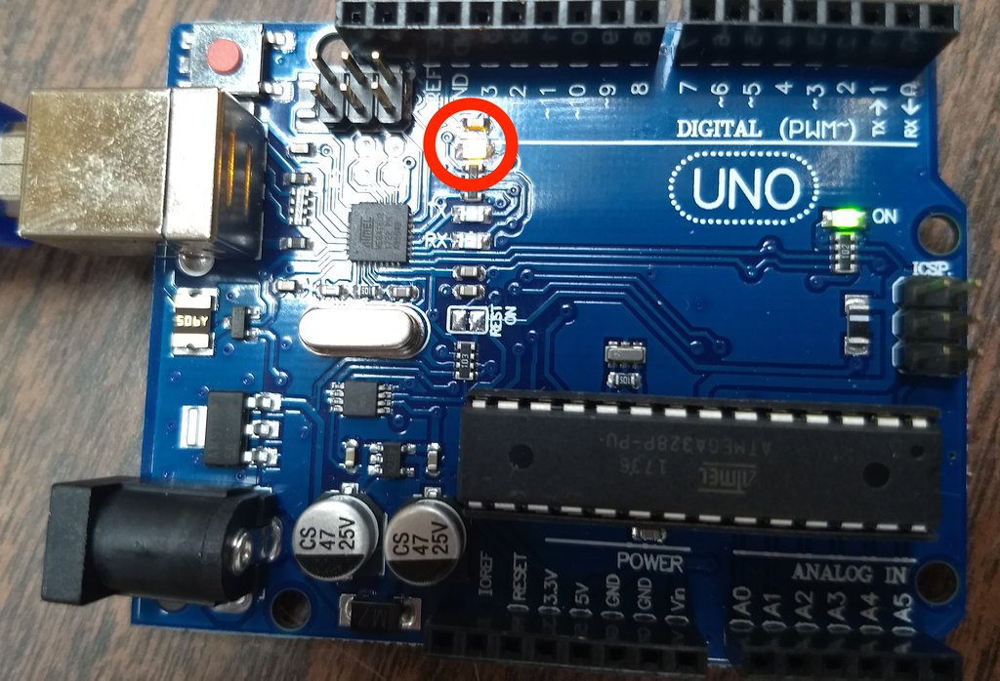

# What is an Arduino?

## Objective

To learn all the parts of an Arduino and how to upload code.

## Kit

## Bill of Materials

- 1 x Arduino with cable

## What is an Arduino?

The Arduino is a cheap real time computer that costs around 7 dollars. Real time means that will execute your code really fast. It can do this because there is no operating system running on the Arduino. The only thing it's doing is running your code. :)

### What are pins?

Pins are the pieces of metal that stick out of the Arduino. They are covered with plastic.

### Where is the Arduino's brain?

### What are the RX and TX leds and pins?

They pins that are used to receive and transmit messages to and from the Arduino. Whenever a message is being sent from the Arduino the TX LED lights up. Whenever a message is being received the RX led lights up.

### Reset Button (reloads the program)

This will restart the Arduino with the code that is already on it.

### Internal Led

This led is built into the Arduino. It will light up when pin 13 is turned on.

